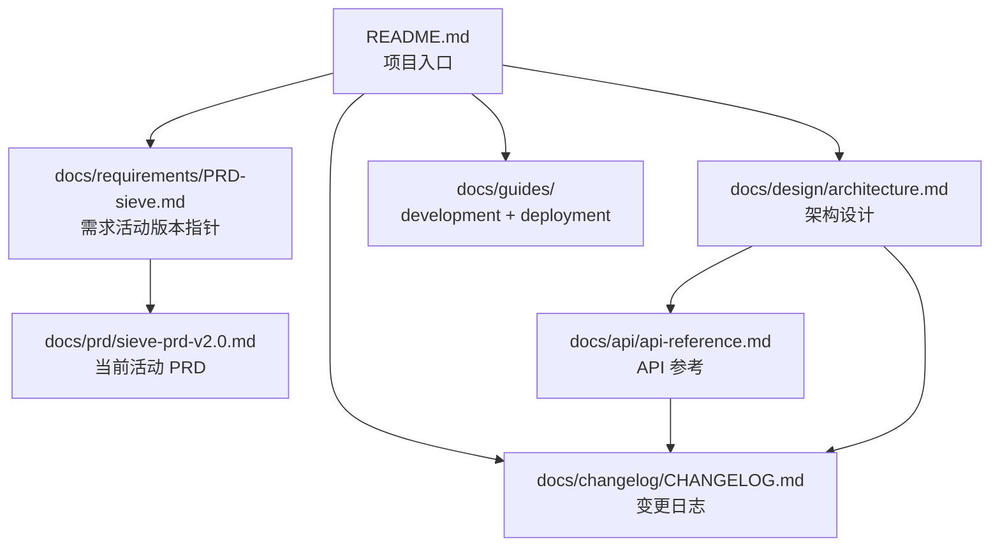

# Sieve

> **本地 LLM 流量代理 · Crypto-native 开发者的最后一道闸**

Sieve 是一个完全本地运行的 LLM 流量代理（Rust 单二进制），夹在 AI 编码 agent（Claude Code / Codex CLI / Cursor 等）和上游模型（Anthropic / OpenAI / 中转站）之间，做双向安全检测，专门服务 crypto-native 开发者。在不可逆动作（签名 / 转账 / 部署）前强制插入认知摩擦，防止私钥泄漏、地址替换、危险工具调用导致的资产损失。

```
┌─────────────┐    ┌─────────────┐    ┌─────────────────┐
│ Claude Code │───▶│    Sieve    │───▶│  Anthropic API  │
│  / Codex /  │    │   (本地)     │    │  / OpenAI / 中转 │
│   Cursor    │◀───│             │◀───│                 │
└─────────────┘    └─────────────┘    └─────────────────┘
                          │
                          ▼
                   出入站规则匹配
                   Critical 拦截
                   人工确认（HIPS）
```

---

## 核心叙事

1. **上游不可信**：你用的中转站可能在改你的 tool_call，官方 API 出问题不会赔你私钥被盗的钱
2. **没人能替你兜底**：钱包安全产品看不见你的 prompt，LLM 安全产品不懂 crypto，DLP 不在你工作流里
3. **Sieve 在客户端最后一道闸**：检测推理完全本地，字节流双向扫描，**永不上传 prompt / response / API key / 使用记录**
4. **你不只是相信我们，你能验证我们**：开源核心引擎、sigstore 签名、可复现构建、透明规则更新日志

> 详见 [PRD §1.2](./docs/prd/sieve-prd-v2.0.md)

### 隐私声明

Sieve 每天 4 次连接更新服务器获取最新规则，请求附带 5 个字段：版本 / OS / CPU 架构 / 本地随机生成的安装 ID（不绑定账号或设备）/ 通道。**不上传 prompt、response、API key 或任何使用记录**。

- `SIEVE_NO_TELEMETRY=1` — 关闭装机统计（规则更新不受影响）
- `SIEVE_NO_UPDATE=1` — 完全禁用更新检查

详见 [SPEC-006](./docs/specs/SPEC-006-update-and-telemetry.md) / [ADR-030](./docs/design/ADR-030-update-telemetry-channel.md)。

---

## 关键差异化（四点护城河）

1. **LLM 流量层位置**——独占
2. **本地推理 + 边界明确的更新通道**——检测全本地零云依赖
3. **Crypto 专项检测**——19 家 LLM/DLP 全无，9 家 AI Agent 安全工具全无
4. **双向检测 + fail-closed**——钱包安全产品看不到 prompt，Sieve 看得到

> 详见 [PRD §2.3](./docs/prd/sieve-prd-v2.0.md)

---

## Quick Start

> ⚠️ Sieve 当前为 GA 前闭测阶段（详见 [项目阶段](#项目阶段)）。下方命令为 GA 后正式发布形态。

### 1. 安装（macOS / Linux）

```bash
# 一键安装脚本（GA 后启用）
curl -fsSL https://sieveai.dev/install.sh | sh

# 或从 release 下载二进制（含 sigstore 签名）
curl -L https://github.com/sieveai/sieve/releases/latest/download/sieve-aarch64-apple-darwin.tar.gz | tar xz
./sieve --version
```

签名验证步骤详见 [docs/guides/deployment.md §3](./docs/guides/deployment.md#3-二进制签名验证必做)（cosign + reproducible build 双重验证）。

### 2. 配置接入

```bash
# 一键配置 Claude Code（写 ANTHROPIC_BASE_URL + 注册 PreToolUse hook + 装 launchd plist）
sieve setup

# 体检
sieve doctor
```

`sieve setup` 内部做的事：
- 检测 Claude Code / Codex CLI / Cursor 安装状态
- 写 `~/.claude/settings.json` 的 `ANTHROPIC_BASE_URL=http://127.0.0.1:9119`
- 注册 PreToolUse hook（[ADR-014 双层防御](./docs/design/ADR-014-dual-layer-defense.md)）
- 装 macOS launchd plist 让 daemon 开机自启

详见 [SPEC-003 sieve setup](./docs/specs/SPEC-003-sieve-setup-tool.md)。

### 3. 验证拦截

```bash
# 让 Claude Code 输出一段「假」助记词（测试样本）
# Sieve 应当截获并发起 HIPS 弹窗（GUI）或写 IPC pending file（CLI）
sieve decisions watch  # 在 GUI 不可用时用 CLI 接管决策
```

### 4. 卸载

```bash
sieve uninstall   # 反向执行 setup 全部步骤
```

完整安装与运维指南：[docs/guides/deployment.md](./docs/guides/deployment.md)
开发与构建：[docs/guides/development.md](./docs/guides/development.md)

---

## 配置

Sieve 读 `~/.sieve/config.toml`，多上游 listener 同时绑（[ADR-026](./docs/design/ADR-026-port-based-listener-routing.md)）：

```toml
[[listener]]
name = "anthropic-official"
port = 9119
protocol = "anthropic"
upstream = "https://api.anthropic.com"
api_key = "${ANTHROPIC_API_KEY}"

[[listener]]
name = "openai-via-relay"
port = 9120
protocol = "openai"
upstream = "https://your-relay.example.com/v1"
api_key = "${RELAY_API_KEY}"

[detection]
sequence_detection = false   # 行为序列检测，GA 默认关闭（ADR-022）

[telemetry]
# 默认开启装机量统计；环境变量 SIEVE_NO_TELEMETRY=1 可全局关闭
enabled = true
```

完整 schema 见 [api-reference §3](./docs/api/api-reference.md) + 注释样例 `sieve.toml.example`。

---

## 项目阶段

Sieve 采用三阶段路线：

| 阶段 | 时间窗 | 描述 |
|------|--------|------|
| **闭测** | GA 前 | 仅小范围邀请用户参与（hackathon builder / 审计研究员）。仓库 private（[ADR-011](./docs/design/ADR-011-private-until-ga.md)）|
| **GA** | Week 12 | 一次性公开 repo + 代码 + 文档。同步发"中转站揭黑" + "自证清白"两篇技术文章 |
| **维护** | GA+ | 规则库每周更新、季度大版本、按真实需求推进 Phase 2 |

**当前**：v2.0 + v2.1 + unix-style v2.x 代码全部落地，等闭测用户验证。质量基线：workspace 725 tests passed / clippy 0 warning / 累计入站规则 70 + 测试样本 1951（含 55 条真实攻击复现），Critical FP 0.00% / Attack Recall 99.71%。

> 详见 [PRD §10 12 周里程碑](./docs/prd/sieve-prd-v2.0.md)

---

## 定价

**Phase 1（GA 后 6–12 个月）：完全免费，无任何付费门槛**——见 [ADR-029](./docs/design/ADR-029-free-first-defer-monetization.md)。

| 阶段 | 价格 | 内容 |
|------|------|------|
| **Phase 1**（GA 后 6–12 个月） | $0 | 全功能 / 无 freemium 限速 / 无用量上限。唯一指标：装机量 |
| **Phase 2+**（装机量阈值后） | TBD | 用户端 Pro 订阅（多账号聚合 / 高级用量分析）和/或 中转站 B 端订阅（监控告警工具，**非结论型认证**）|

**永久排除的方向**（[ADR-029](./docs/design/ADR-029-free-first-defer-monetization.md) §决策 2）：「中转站认证 + 排名广告」收费——评级机构利益冲突会摧毁 Sieve「客观本地审计」的产品定位。

---

## 自证清白（Self-Custody Trust）

Sieve 自己被同一套标准审视：

- **sigstore 签名** + **reproducible build**：每个 release 可独立复现验证
- **pinned dependencies**：避免 LiteLLM 类供应链事件
- **核心引擎 GA 后开源（MIT）**：拦截逻辑全部可审；Phase 2 高级规则集闭源
- **透明规则更新日志**：每次更新发布 changelog + 哈希，用户可独立验证

> 详见 [PRD §1.2 / §9 #6 / §11.3](./docs/prd/sieve-prd-v2.0.md) / [ADR-006](./docs/design/ADR-006-sigstore-reproducible-build.md)

---

## 技术栈

**Rust** + **hyper**（HTTP/反代）+ **tokio**（async）+ **rustls**（TLS）+ **vectorscan-rs**（SIMD 多模式正则）+ **serde_json**（JSON 解析）

> 详见 [PRD §6.3](./docs/prd/sieve-prd-v2.0.md)

---

## 文档导航

| 入口 | 用途 |
|------|------|
| [docs/requirements/PRD-sieve.md](./docs/requirements/PRD-sieve.md) | 需求文档活动版本入口（指向 PRD v2.0）|
| [docs/glossary.md](./docs/glossary.md) | 术语表（54 条专业术语统一定义）|
| [docs/design/ADR-INDEX.md](./docs/design/ADR-INDEX.md) | ADR 索引 |
| [docs/design/architecture.md](./docs/design/architecture.md) | 架构设计 |
| [docs/api/api-reference.md](./docs/api/api-reference.md) | API 参考 |
| [docs/guides/development.md](./docs/guides/development.md) | 开发指南 |
| [docs/guides/deployment.md](./docs/guides/deployment.md) | 部署与运维指南 |
| [docs/changelog/CHANGELOG.md](./docs/changelog/CHANGELOG.md) | 变更日志 |
| [SECURITY.md](./SECURITY.md) | 安全策略 + 漏洞报告流程 |
| [LICENSE](./LICENSE) | 许可说明（文档 CC BY-NC-SA 4.0 / 代码 MIT 待 GA）|
| [CLAUDE.md](./CLAUDE.md) | Claude Code 项目指引（贡献者参考）|

---

## 合规提示

> ⚠️ **海外公司主体 + 中国大陆境内不做 to-C 公开商业化**
>
> - 公司海外注册（首选香港有限公司或新加坡 Pte Ltd），不接受大陆个人/个体户作为收款主体
> - 境内渠道发研究内容，境外渠道发产品营销——Twitter / Hacker News / Mirror 是主战场
> - Sieve 完全本地运行 + 不上传 prompt → 不触发数据出境合规
> - 详见 [PRD §11.5](./docs/prd/sieve-prd-v2.0.md)

---

## 反馈渠道

- **GitHub Issues**：本仓库 issue 列表（公开样本提交也走这里）
- **安全漏洞**：见 [SECURITY.md](./SECURITY.md)
- **社区**：Twitter / Hacker News / Mirror（GA 后启用）

---

## 文档关联图



> 派生关系：上游文档变更时，必须检查并更新所有下游文档（详见 [.cursorrules](./.cursorrules) 文档规则段落）。
