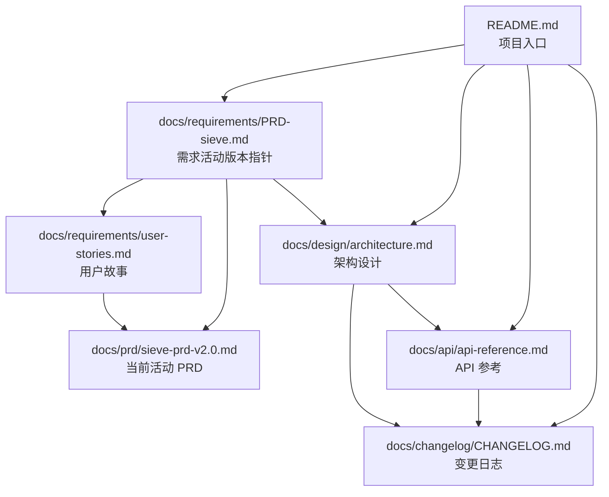

# Sieve

> **本地 LLM 流量代理 · Crypto-native 开发者的最后一道闸**

Sieve 是一个完全本地运行的 LLM 流量代理（Rust 单二进制），夹在 AI 编码 agent（首期只支持 Claude Code）和上游模型之间，做双向安全检测，专门服务 crypto-native 开发者。在不可逆动作（签名 / 转账 / 部署）前强制插入认知摩擦，防止私钥泄漏、地址替换、危险工具调用导致的资产损失。

---

## 项目状态

**项目状态**：**v2.0 + v2.1 + unix-style v2.x 全部落地（2026-05-05）— 进入 dogfood 准备阶段**

**2026-05-05 单日完成 unix-style 改造 v2.x 全部 5 项 TODO**（13 commits，详见 [ADR-026](docs/design/ADR-026-port-based-listener-routing.md) / [ADR-028](docs/design/ADR-028-ipc-protocol-neutralization.md)）：

- **Multi-listener**（ADR-026）：daemon 同时绑多个 port，哑 client（Claude Code / Codex CLI / Cursor）通过指向不同 port 切换上游，无须注入路由 header；listener 显式声明协议（`anthropic` / `openai`），错位请求 fail-closed 400 拒绝；`Forwarder` 修复 v1.x path prefix bug（DeepSeek `/anthropic` 等中转站可用）；audit 加 `provider_id` 列（SQLite v3 schema migration）；IPC `HealthResult.listeners` 数组；doctor multi-listener 体检
- **IPC 中性化**（ADR-028）：SPEC-005 协议术语中性化（371 处，daemon 不感知 client 形态）；sieve-ipc crate 内部模块化（protocol / server / client 子目录，零 IO 依赖硬约束）
- **Headless CLI**：新增 `sieve decisions watch/show/resolve`（远程 SSH / GUI 不在线时 CLI 接管决策）+ `sieve audit tail/query/show`（jsonl 输出，接 jq / fluentd）
- **TODO-6 Network jail**（ADR-027）推后到 v3.x post-GA opt-in

**v2.0 + v2.1 基础**（2026-05-01 落地）：PRD v2.0 HIPS 改造全部完成：6 crate（含 **sieve-policy**）/ 三态决策 + 灰名单 + Critical 锁三道防线 / 用户规则系统 / 规则引擎抽象（MatchEngine trait + LayeredEngine zero-downtime hot swap）/ 进程上下文记录（macOS proc_pidinfo + peer_addr 反查）/ 行为序列窗口骨架（IN-SEQ-01/02/03 默认关闭）/ v2.1 工程项（arc-swap hot swap / 多 client broadcast / 审计全路径覆盖）。

**仅剩非代码工作**：vectorscan_rs API / origin_header 真实密钥 / OpenClaw skill_install_guard Week 7 实测 / 行为序列升级 Block ADR 评审 / ML 分类器训练。Phase 1 GA 阻塞从代码侧完全转移到商业基础设施侧 + dogfood 验证。

**质量基线**：workspace 725 passed / clippy 0 / fmt clean。累计入站规则 70 + 测试数据集 1951（含 55 条真实攻击复现），Critical FP 0.00% + Attack Recall 99.71%，release 二进制 9.0 MB。repo 保持 private 至 Week 12 GA（[ADR-011](docs/design/ADR-011-private-until-ga.md)）。

- 当前最新 PRD：[sieve-prd-v2.0.md](./docs/prd/sieve-prd-v2.0.md)（已锁定执行）
- 12 周里程碑：8 周 dogfood + 4 周闭测 → GA 开源

---

## 核心叙事（四句话）

1. **上游不可信**：你用的中转站可能在改你的 tool_call，官方 API 出问题不会赔你私钥被盗的钱
2. **没人能替你兜底**：钱包安全产品看不见你的 prompt，LLM 安全产品不懂 crypto，DLP 不在你工作流里
3. **Sieve 在客户端最后一道闸**：检测推理完全本地，字节流双向扫描，**永不上传 prompt / response / API key / 使用记录**。规则更新通道（每天 4 次）默认附带匿名安装 ID 用于装机统计，三个环境变量可一键关闭（详见 [ADR-030](docs/design/ADR-030-update-telemetry-channel.md)）。
4. **你不只是相信我们，你能验证我们**：开源核心引擎、sigstore 签名、可复现构建、透明规则更新日志——所有出站请求可用 tcpdump / mitmproxy 审视（最多 5 字段：版本 / OS / 架构 / 安装 ID / 通道），Sieve 自己被同一套标准审视，绝不成为新的供应链风险

> 详见 PRD §1.2

---

## 关键差异化（四点护城河）

1. **LLM 流量层位置**——独占
2. **本地推理 + 边界明确的更新通道**——检测全本地零云依赖；唯一上传是规则更新心跳（每天 4 次,5 字段匿名,可关闭,见 [ADR-003 amended](docs/design/ADR-003-local-only-no-cloud-verifier.md) + [ADR-030](docs/design/ADR-030-update-telemetry-channel.md)）
3. **Crypto 专项检测**——19 家 LLM/DLP 全无，9 家 AI Agent 安全工具全无
4. **双向检测 + fail-closed**——钱包安全产品看不到 prompt，Sieve 看得到

> 详见 PRD §2.3

---

## 12 周里程碑摘要

| 阶段                    | 时间窗       | 一句话                                                            |
| --------------------- | --------- | -------------------------------------------------------------- |
| **Phase A · dogfood** | Week 1-8  | 基础设施 + 出入站规则 + benchmark 数据集 + doskey 自用 8 周打磨                 |
| **Phase B · 闭测**      | Week 9-12 | 5+5 名海外 hackathon builder / 审计研究员闭测，GA 同步发"中转站揭黑" + "自证清白"两篇文章 |
| **Phase C · 维护**      | Week 13+  | 每周 5-10 小时慢节奏：规则库每周更新、季度大版本、按真实需求推进 Phase 2                    |

> 详见 PRD §10

---

## 定价

**Phase 1（GA 后 6–12 个月）：完全免费,无任何付费门槛**——see [ADR-029](docs/design/ADR-029-free-first-defer-monetization.md)。

| 阶段         | 价格   | 内容                              |
| ---------- | ---- | ------------------------------- |
| **Phase 1**（GA 后 6–12 个月） | $0   | 全功能 / 无 freemium 限速 / 无用量上限。唯一指标:装机量 |
| **Phase 2+**（装机量阈值后） | TBD  | 用户端 Pro 订阅（多账号聚合 / 高级用量分析）和/或 中转站 B 端订阅（监控告警工具,**非结论型认证**）。具体路径待 6 个月装机数据出来后定 |

**永久排除的方向**（ADR-029 §决策 2）：「中转站认证 + 排名广告」收费——评级机构利益冲突会摧毁 Sieve「客观本地审计」的产品定位。

历史 PRD §7 定价（已被 ADR-029 替换,留作记录）

| 阶段         | 价格                        | 内容                              |
| ---------- | ------------------------- | ------------------------------- |
| **14 天试用** | $0                        | 全功能                             |
| **正式版**    | **$49/月**（年付 $490，省 2 个月） | 全功能                             |
| **降级模式**   | $0                        | 试用结束未付费：**只读警告**，不再 Critical 拦截 |

---

## 合规提示

> ⚠️ **海外公司主体 + 中国大陆境内不做 to-C 公开商业化**
>
> - 公司必须海外注册（**首选香港有限公司或新加坡 Pte Ltd**），不接受大陆个人/个体户作为 Stripe 收款主体
> - **境内渠道发研究内容，境外渠道发产品营销**——Twitter / Hacker News / Mirror 是主战场，微信公众号 / 小红书 / 知乎 / B 站不规划
> - Sieve 完全本地运行 + 不上传 prompt → 不触发数据出境合规
> - 详见 PRD §11.5（中国大陆合规边界）

---

## 文档导航

| 入口                                                                       | 用途                                                  |
| ------------------------------------------------------------------------ | --------------------------------------------------- |
| [docs/requirements/PRD-sieve.md](./docs/requirements/PRD-sieve.md)       | 需求文档活动版本入口（指向 PRD v2.0）                             |
| [docs/requirements/user-stories.md](./docs/requirements/user-stories.md) | 用户故事（13 条 P0/P1）                                    |
| [docs/glossary.md](./docs/glossary.md)                                   | **术语表**（54 条专业术语统一定义）                              |
| [docs/design/ADR-INDEX.md](./docs/design/ADR-INDEX.md)                   | **ADR 索引**（21 个已接受 + 候选 ADR）                       |
| [docs/design/architecture.md](./docs/design/architecture.md)             | 架构设计                                                |
| [docs/design/data-model.md](./docs/design/data-model.md)                 | 数据模型（fingerprint / SQLite schema / license）         |
| [docs/api/api-reference.md](./docs/api/api-reference.md)                 | API 参考（Anthropic Messages API + SSE + 本地管理 API）    |
| [docs/guides/development.md](./docs/guides/development.md)               | 开发指南                                                |
| [docs/guides/deployment.md](./docs/guides/deployment.md)                 | 部署与运维指南                                             |
| [docs/changelog/CHANGELOG.md](./docs/changelog/CHANGELOG.md)             | 变更日志                                                |
| [docs/prd/](./docs/prd/)                                                 | PRD 历史归档（v1.0 → v2.0）                               |
| [docs/research/](./docs/research/)                                       | 调研材料（deep-research-report）                          |
| [tasks/roadmap.md](./tasks/roadmap.md)                                   | **12 周里程碑可勾选执行清单**                                  |
| [tasks/lessons.md](./tasks/lessons.md)                                   | 经验教训记录                                              |
| [SECURITY.md](./SECURITY.md)                                             | **安全策略 + 漏洞报告流程**                                  |
| [LICENSE](./LICENSE)                                                     | 许可说明（文档 CC BY-NC-SA 4.0 / 代码 MIT 待 GA）              |
| [CLAUDE.md](./CLAUDE.md)                                                 | Claude Code 项目指引                                    |
| [.github/](./.github/)                                                   | Issue / PR 模板 + Dependabot 配置                       |

---

## 技术栈

**Rust** + **hyper** (HTTP/反代) + **tokio** (async) + **rustls** (TLS) + **vectorscan-rs** (SIMD 多模式正则) + **serde_json** (JSON 解析) — hyper / tokio / rustls / vectorscan-rs / serde_json

> 详见 PRD §6.3

---

## 自证清白（Self-Custody Trust）

Sieve 自己被同一套标准审视：

- **sigstore 签名** + **reproducible build**：每个 release 都可独立复现验证
- **pinned dependencies**：避免 LiteLLM 类供应链事件
- **核心引擎 GA 后开源（MIT）**：Phase 2 高级规则集闭源，但拦截逻辑全部可审
- **透明规则更新日志**：每次规则更新发布 changelog + 哈希，用户可独立验证

> 详见 PRD §1.2 第 4 句、§9 第 6 条、§11.3

---

## 反馈渠道

- **GitHub Issues**：本仓库 issue 列表（公开样本提交也走这里）
- **Twitter**：[@doskey](https://twitter.com/doskey)

---

## 文档关联图

> 派生关系：上游文档变更时，必须检查并更新所有下游文档（详见 [.cursorrules](./.cursorrules) 文档规则段落）。

