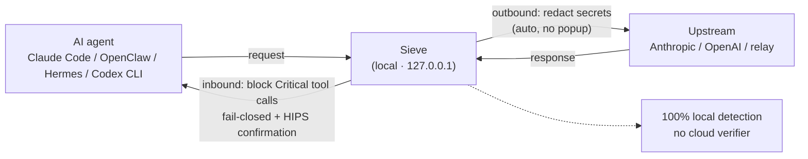
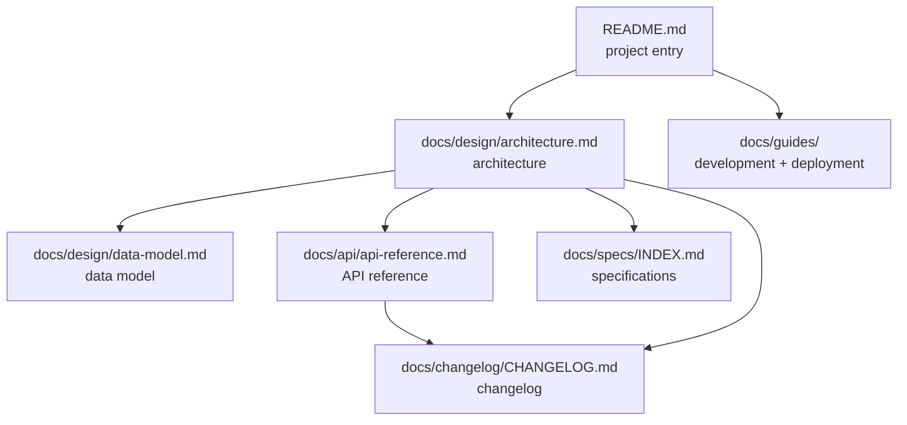

# Sieve

English | [中文](./README.zh-CN.md)

[](./LICENSE)
[](#installation-phase-1-macos-only)
[](#project-status)

> **A fully local LLM-traffic security proxy — the last gate before irreversible actions.**

Sieve is a fully local LLM-traffic security proxy (a single Rust binary) that sits between your AI coding agent (Claude Code / OpenClaw / Hermes / Codex CLI) and the upstream model API (Anthropic / OpenAI / relays). It inspects traffic in both directions — redacting secrets on the way out, and blocking dangerous tool calls on the way in (fail-closed) — to force a moment of cognitive friction before irreversible actions (signing, transfers, deploys). Built for crypto-native developers.

All detection reasoning runs 100% on your machine. Sieve never uploads your prompts, responses, or API keys.

---

## How it works

Your agent points its base URL at a loopback listener (`127.0.0.1`). Sieve forwards traffic to the real upstream over end-to-end TLS — it does **not** install a local CA or MITM your connection. On the way out it matches outbound rules and redacts secrets in place; on the way in it intercepts Critical tool calls and holds them for human confirmation (HIPS — Host Intrusion Prevention System).



The only outbound traffic Sieve itself makes is to fetch signed rule updates — see [Privacy](#privacy).

---

## Why Sieve

1. **The upstream is untrusted** — the relay you route through can rewrite your `tool_call`; the official API will not reimburse you when a leaked key drains a wallet.
2. **Nobody else has your back** — wallet-security products never see your prompt, LLM-security products do not understand crypto, and DLP does not live in your workflow.
3. **Sieve is the last gate on the client** — detection reasoning is fully local, the byte stream is scanned in both directions, and Sieve **never uploads your prompt, response, API key, or any usage record**.
4. **You do not just trust us, you can verify us** — public source code, signed releases, reproducible builds, and a transparent rule-update changelog.

---

## Privacy

Sieve connects to the update server **4 times a day** to fetch the latest rules. Each request carries only **5 fields**: version / OS / CPU architecture / a locally generated random install-id (not tied to any account or device) / channel. It **never uploads prompts, responses, API keys, or any usage record**.

- `SIEVE_NO_TELEMETRY=1` — disable install-count telemetry (rule updates are unaffected).
- `SIEVE_NO_UPDATE=1` — disable update checks entirely.

See [SPEC-006](./docs/specs/SPEC-006-update-and-telemetry.md).

---

## What sets Sieve apart

1. **Positioned at the LLM-traffic layer** — Sieve sees the full request/response stream, where wallet-security products and DLP cannot reach.
2. **Local inference + a clearly bounded update channel** — detection is 100% local, zero cloud dependency.
3. **Crypto-specific detection** — secret/mnemonic/private-key formats (including BIP39 with SHA-256 checksum verification, WIF and BIP-32 extended keys via Base58Check) and on-chain address-substitution detection, purpose-built for crypto-native workflows.
4. **Bidirectional detection + fail-closed** — Critical cannot be disabled in any mode.

### Capabilities at a glance

- **Bidirectional inspection** — outbound secret redaction (auto-rewrite in place, no popup, 5s status-bar notice) + inbound interception of dangerous tool calls (fail-closed + human confirmation).
- **Four-route parity** — every inbound detection covers all four content-type routes: Anthropic SSE, Anthropic JSON, OpenAI SSE, OpenAI JSON. A feature can never ship streaming-only and silently miss non-streaming traffic.
- **Crypto private-key formats** — API keys and high-entropy secrets, BIP39 mnemonics (SHA-256 checksum verified), Bitcoin WIF and BIP-32 extended private keys (xprv) via Base58Check.
- **Address-substitution detection** — tracks EVM addresses seen in a session and flags near-identical substitutes.
- **Outbound exfiltration-chain detection** — multi-step secret-exfiltration patterns layered on behavioral-sequence detection (notify-only, conservative defaults).
- **Canary decoy detection** — plants decoy files in sensitive credential/wallet directories; any tool call that reads one raises an inbound alert.
- **Configurable routing table** — relays that are protocol-compatible but use non-standard paths can be onboarded with a single `[[upstream.routes]]` config line, zero code changes.
- **Four agents supported** — Claude Code / OpenClaw / Hermes / Codex CLI.

---

## Quick Start

> ⚠️ Sieve is currently an **early preview (0.1.0-alpha)** (see [Project status](#project-status)). Today the supported path is building from source / invited alpha preview; the commands below describe the released form, with package installers coming soon.

### Installation (Phase 1: macOS only)

Most `curl … | sh` installers ask you to blindly trust a script piping straight into your shell. Sieve's does the opposite: **before it lands anything on disk, the installer verifies its own release artifacts** with cosign / sigstore (keyless signatures + Rekor transparency log). If a binary has been tampered with or doesn't come from Sieve's release workflow, it **fails closed and refuses to install**. One command, still verifiable. Verification is the homework the installer does for you — not a hurdle it hands you. A security tool's installer should look exactly like this.

Pick the path that fits you, from frictionless to hardcore:

**1. Homebrew (recommended on macOS)** — brew verifies sha256 natively.

```bash
# CLI / daemon
brew tap SieveAI-dev/sieve && brew install sieve
# GUI .app
brew install --cask sieve
```

**2. Self-verifying one-line installer** — installs the `sieve` CLI / daemon binary. Downloads the bare binary plus its `.sigstore.json` bundle, verifies before install (cosign if present, else falls back to checking sha256 against `SHA256SUMS` with an explicit warning), and fails closed on any mismatch.

```bash
curl --proto '=https' --tlsv1.2 -fsSL https://raw.githubusercontent.com/SieveAI-dev/sieve/main/scripts/install.sh | bash
```

> A branded short link `sieveai.dev/install.sh` will front this script — coming soon.

**3. cargo install** — build from source.

```bash
cargo install --git https://github.com/SieveAI-dev/sieve sieve-cli   # available now
cargo install sieve                                                  # from crates.io, from Phase 2
```

**4. Manual (for the paranoid)** — download the signed `.dmg` (GUI) or bare binary from [GitHub Releases](https://github.com/SieveAI-dev/sieve/releases) and verify the cosign signature by hand. See [Verify it yourself](#verify-it-yourself) below and [deployment.md](./docs/guides/deployment.md).

After install, GUI users mount the `.dmg`, drag `SieveGUI.app` into `/Applications`, and on first launch run `sieve setup`. Linux and Windows are deferred to Phase 2.

### Connect your agent

```bash
# One-shot configuration for Claude Code
# (sets ANTHROPIC_BASE_URL + registers the PreToolUse hook + installs the launchd plist)
sieve setup

# Health check
sieve doctor
```

What `sieve setup` does internally:

- detects which of Claude Code / OpenClaw / Hermes / Codex CLI are installed;
- writes `ANTHROPIC_BASE_URL=http://127.0.0.1:11453` into `~/.claude/settings.json`;
- registers the PreToolUse hook (dual-layer defense);
- installs a macOS launchd plist so the daemon starts at login.

Full install and operations guide: [docs/guides/deployment.md](./docs/guides/deployment.md). Development and build: [docs/guides/development.md](./docs/guides/development.md).

### Verify it yourself

Verification already happened automatically during install — the installer (and Homebrew) refuse to land anything that doesn't pass. Run `sieve doctor` to see the verification status. The steps below are **optional**, for those who want to re-verify by hand.

**Manual cosign verification (optional):**

```bash
cosign verify-blob \
  --certificate-identity-regexp '^https://github.com/SieveAI-dev/sieve/\.github/workflows/release\.yml@refs/tags/v[0-9.]+$' \
  --certificate-oidc-issuer 'https://token.actions.githubusercontent.com' \
  --bundle SieveGUI-<version>.dmg.sigstore \
  SieveGUI-<version>.dmg
# expected output: Verified OK
```

Every signature is also written to the public [Rekor](https://search.sigstore.dev/) transparency log, and every release can be independently reproduced bit-for-bit from source — see [deployment.md §3](./docs/guides/deployment.md). Any re-signing leaves a trace in Rekor and cannot be done silently.

### Verify interception

```bash
# Have Claude Code emit a fake mnemonic (test sample).
# Sieve should intercept it and raise a HIPS prompt (GUI) or write an IPC pending file (CLI).
sieve decisions watch   # take over decisions from the CLI when the GUI is unavailable
```

### Uninstall

```bash
sieve uninstall   # reverses every step of setup
```

---

## Configuration

Sieve reads `~/.sieve/config.toml` and can bind multiple upstream listeners at once:

```toml
[[listener]]
name = "anthropic-official"
port = 11453
protocol = "anthropic"
upstream = "https://api.anthropic.com"
api_key = "${ANTHROPIC_API_KEY}"

[[listener]]
name = "openai-via-relay"
port = 11454
protocol = "openai"
upstream = "https://your-relay.example.com/v1"
api_key = "${RELAY_API_KEY}"

# Optional: onboard a protocol-compatible relay that uses a non-standard path
# with a single route line — no code changes.
[[upstream.routes]]
path = "/custom/chat"
provider = "openai"

[detection]
sequence_detection = false   # behavioral-sequence detection, off by default

[telemetry]
# Install-count telemetry is on by default; SIEVE_NO_TELEMETRY=1 disables it globally.
enabled = true
```

Full schema: [api-reference §3](./docs/api/api-reference.md).

---

## Project status

The repository is **public**, at an **early-preview stage (0.1.0-alpha)**. The source is public to make good on the trust narrative — *verifiable, not merely trusted*. Today the supported path is building from source / invited alpha preview, with one-line installers and automatic rule updates being polished.

What already works: bidirectional detection (outbound secret redaction + inbound fail-closed interception of Critical tool calls), four-route content-type parity (Anthropic/OpenAI × SSE/JSON), Critical interception that cannot be disabled in any mode, fully local detection with zero cloud verification, signed rule packages, and four supported agents (Claude Code / OpenClaw / Hermes / Codex CLI). The detection engine ships with an extensive test suite that includes real attack-reproduction samples.

---

## Self-custody trust

Sieve holds itself to the same standard it applies to the upstream:

- **sigstore signing + reproducible builds** — every release can be independently reproduced and verified.
- **Pinned dependencies** — to avoid supply-chain incidents.
- **Public source** — the interception logic is fully auditable.
- **Transparent rule-update log** — every update ships a changelog and hashes so users can verify independently.

---

## Tech stack

**Daemon:** Rust + hyper (HTTP / reverse proxy) + tokio (async) + rustls (TLS) + vectorscan-rs (SIMD multi-pattern regex) + serde_json.

**GUI:** SwiftUI + Combine (macOS 13+, Apple Silicon + Intel) — maintained in the separate [`SieveAI-dev/sieve-gui-macos`](https://github.com/SieveAI-dev/sieve-gui-macos) repository.

---

## Documentation

| Entry | Purpose |
|------|------|
| [docs/glossary.md](./docs/glossary.md) | Glossary — unified definitions of domain terms |
| [docs/design/architecture.md](./docs/design/architecture.md) | Architecture design |
| [docs/design/data-model.md](./docs/design/data-model.md) | Data model |
| [docs/api/api-reference.md](./docs/api/api-reference.md) | API reference (incl. config schema) |
| [docs/specs/INDEX.md](./docs/specs/INDEX.md) | Technical specifications, index |
| [docs/guides/development.md](./docs/guides/development.md) | Development & build guide |
| [docs/guides/deployment.md](./docs/guides/deployment.md) | Deployment & operations guide |
| [docs/changelog/CHANGELOG.md](./docs/changelog/CHANGELOG.md) | Changelog |
| [CLAUDE.md](./CLAUDE.md) | Project guide for contributors using Claude Code |

Project site: [sieveai.dev](https://sieveai.dev)

### Documentation map



> Derivation rule: when an upstream document changes, all downstream documents must be checked and updated.

---

## Contributing

Contributions are welcome. Please read [CONTRIBUTING.md](./CONTRIBUTING.md) and our [Code of Conduct](./CODE_OF_CONDUCT.md) before opening a pull request. Public sample submissions and bug reports go through [GitHub Issues](https://github.com/SieveAI-dev/sieve/issues).

## Security

Please **do not** report security vulnerabilities through public GitHub issues. Report privately via [GitHub Security Advisories](https://github.com/SieveAI-dev/sieve/security/advisories/new) — see [SECURITY.md](./SECURITY.md) for the full disclosure process.

## License

- **Code** — [Apache License 2.0](./LICENSE)
- **Documentation** (everything under `docs/`, plus README / CLAUDE.md and other non-source Markdown / configuration) — [CC BY-NC-SA 4.0](./LICENSE-DOCS)
