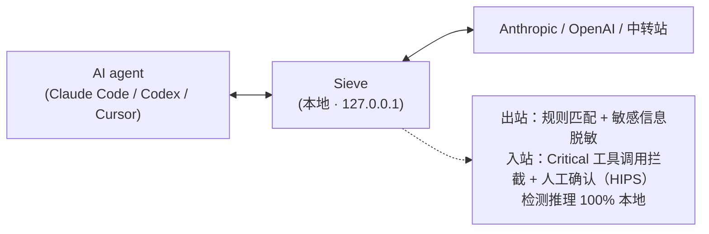

# Sieve

[English](./README.md) | 中文

[](./LICENSE)
[](#安装phase-1-仅-macos)
[](#项目状态)

> **完全本地运行的 LLM 流量安全代理——不可逆动作前的最后一道闸。**

Sieve 是一个完全本地运行的 LLM 流量安全代理（Rust 单二进制），夹在你的 AI 编码 agent（Claude Code / Codex CLI / Cursor）和上游模型 API（Anthropic / OpenAI / 中转站）之间。它对双向流量做检测——出站脱敏（redacting secrets），入站拦截危险工具调用（fail-closed）——在不可逆动作（签名、转账、部署）之前强制插入一个认知摩擦的瞬间。专为 crypto-native 开发者打造。



---

## 为什么需要 Sieve

1. **上游不可信**——你路由经过的中转站可能改写你的 `tool_call`；官方 API 不会在私钥泄漏导致钱包被掏空时赔你钱。
2. **没人能替你兜底**——钱包安全产品永远看不到你的 prompt，LLM 安全产品不懂 crypto，DLP 不在你的工作流里。
3. **Sieve 是客户端的最后一道闸**——检测推理完全本地，字节流双向扫描，**永不上传你的 prompt、response、API key 或任何使用记录**。
4. **你不只是相信我们，你能验证我们**——源码公开、release 签名、可复现构建、透明的规则更新日志。

---

## 隐私

Sieve 每天 **4 次**连接更新服务器获取最新规则。每次请求仅附带 **5 个字段**：版本 / OS / CPU 架构 / 本地随机生成的安装 ID（install-id，不绑定任何账号或设备）/ 通道（channel）。它**永不上传 prompt、response、API key 或任何使用记录**。

- `SIEVE_NO_TELEMETRY=1` —— 关闭匿名安装统计（规则更新不受影响）。
- `SIEVE_NO_UPDATE=1` —— 完全禁用更新检查。

---

## 关键差异化（护城河）

1. **LLM 流量层的独占站位**——钱包安全产品看不到 prompt，DLP 不在工作流里。
2. **本地推理 + 边界明确的更新通道**——检测 100% 本地，零云依赖。
3. **Crypto 专项检测**——对照调研的 19 家 LLM/DLP 产品全无、9 家 AI Agent 安全工具全无此能力。
4. **双向检测 + fail-closed**——Critical 在任何模式下都不可关闭。

---

## Quick Start

> ⚠️ Sieve 当前处于 **GA 前闭测（pre-GA closed beta）**（见[项目状态](#项目状态)）。下方命令描述的是 GA 后的正式发布形态。

### 安装（Phase 1 仅 macOS）

大多数 `curl … | sh` 安装脚本要你盲信一段直接管进 shell 的脚本。Sieve 的安装器反着来：**在把任何东西落地前，它先用 cosign / sigstore（keyless 签名 + Rekor 透明日志）校验自己的 release 产物。** 二进制一旦被篡改、或来源不是 Sieve 的 release workflow，就**fail-closed 拒装**。一行命令，照样可验。校验是安装器替你做的家庭作业，不是甩给你的门槛。安全工具的安装器本就该长这样（[ADR-036](./docs/design/ADR-036-self-verifying-installer.md)）。

按从无摩擦到硬核的顺序，挑一条适合你的路：

**1. Homebrew（macOS 首选）**——brew 原生自动校验 sha256。

```bash
# CLI / daemon
brew tap SieveAI-dev/sieve && brew install sieve
# GUI .app
brew install --cask sieve
```

**2. 自校验一行安装器**——安装 `sieve` CLI / daemon 二进制。下载裸二进制 + 同名 `.sigstore.json` bundle，落地前自动校验（有 cosign 用 cosign 验签，无则回退对照 `SHA256SUMS` 校验 sha256 并明确警告），任一不符即 fail-closed 拒装。

```bash
curl --proto '=https' --tlsv1.2 -fsSL https://raw.githubusercontent.com/SieveAI-dev/sieve/main/scripts/install.sh | bash
```

> GA 后会用品牌短链 `sieveai.dev/install.sh` 代理此脚本（待部署）。

**3. cargo install**——从源码构建。

```bash
cargo install --git https://github.com/SieveAI-dev/sieve sieve-cli   # 现可用
cargo install sieve                                                  # crates.io，Phase 2 起
```

**4. 手动（给偏执狂）**——从 [GitHub Releases](https://github.com/SieveAI-dev/sieve/releases) 下签名 `.dmg`（GUI）或裸二进制，手动用 cosign 验签。见下方[给偏执狂的完整验证](#给偏执狂的完整验证)与 [deployment.md](./docs/guides/deployment.md)。

安装后，GUI 用户挂载 `.dmg`，将 `SieveGUI.app` 拖入 `/Applications`，首次启动运行 `sieve setup`。Linux、Windows 推后到 Phase 2。

### 接入你的 agent

```bash
# 一键配置 Claude Code
# （写 ANTHROPIC_BASE_URL + 注册 PreToolUse hook + 装 launchd plist）
sieve setup

# 体检
sieve doctor
```

`sieve setup` 内部做的事：

- 检测 Claude Code / Codex CLI / Cursor 是否安装；
- 把 `ANTHROPIC_BASE_URL=http://127.0.0.1:9119` 写入 `~/.claude/settings.json`；
- 注册 PreToolUse hook（双层防御）；
- 装 macOS launchd plist 让 daemon 开机自启。

### 给偏执狂的完整验证

验证已在安装时自动完成——安装器（与 Homebrew）都会拒绝任何过不了校验的产物。运行 `sieve doctor` 可查看验证状态。下面的步骤是**可选的**，给想亲手再验一遍的人。

**手动 cosign 验签（可选）：**

```bash
cosign verify-blob \
  --certificate-identity-regexp '^https://github.com/SieveAI-dev/sieve/\.github/workflows/release\.yml@refs/tags/v[0-9.]+$' \
  --certificate-oidc-issuer 'https://token.actions.githubusercontent.com' \
  --bundle SieveGUI-<version>.dmg.sigstore \
  SieveGUI-<version>.dmg
# 期望输出：Verified OK
```

每次签名都会写入公开的 [Rekor](https://search.sigstore.dev/) 透明日志，每个 release 也可从源码逐字节复现——见 [deployment.md §3](./docs/guides/deployment.md)与 [ADR-006](./docs/design/ADR-006-sigstore-reproducible-build.md)。任何「重签名」都会在 Rekor 留痕，无法静默替换。

### 验证拦截

```bash
# 让 Claude Code 输出一段「假」助记词（测试样本）。
# Sieve 应当截获并发起 HIPS 弹窗（GUI）或写 IPC pending file（CLI）。
sieve decisions watch   # GUI 不可用时用 CLI 接管决策
```

### 卸载

```bash
sieve uninstall   # 反向执行 setup 的全部步骤
```

---

## 配置

Sieve 读 `~/.sieve/config.toml`，可同时绑定多个上游 listener：

```toml
[[listener]]
name = "anthropic-official"
port = 9119
protocol = "anthropic"
upstream = "https://api.anthropic.com"
api_key = "${ANTHROPIC_API_KEY}"

[[listener]]
name = "openai-via-relay"
port = 9120
protocol = "openai"
upstream = "https://your-relay.example.com/v1"
api_key = "${RELAY_API_KEY}"

[detection]
sequence_detection = false   # 行为序列检测，GA 默认关闭

[telemetry]
# 默认开启匿名安装统计；SIEVE_NO_TELEMETRY=1 可全局关闭。
enabled = true
```

---

## 项目状态

仓库现已 **public**，处于 **GA 前闭测（pre-GA closed beta，仅邀请测试者）**。源码公开是为兑现信任叙事——*可验证，而非仅信任*。

质量基线：Critical 误报率（False Positive）**0.00%** / 攻击召回率（Attack Recall）**99.71%**；**clippy 0 warning**；含真实攻击复现样本的完整测试套件。

---

## 自证清白（[redacted]）

Sieve 用对待上游的同一套标准审视自己：

- **release 签名 + 可复现构建**——每个 release 都可被独立复现并验证。
- **pinned dependencies**——避免供应链事件。
- **源码公开**——拦截逻辑全部可审。
- **透明规则更新日志**——每次更新发布 changelog + 哈希，用户可独立验证。

---

## 技术栈

**Rust** + **hyper**（HTTP / 反向代理）+ **tokio**（async）+ **rustls**（TLS）+ **vectorscan-rs**（SIMD 多模式正则）+ **serde_json**（JSON 解析）。

macOS 原生 GUI 在独立仓库 [`SieveAI-dev/sieve-gui-macos`](https://github.com/SieveAI-dev/sieve-gui-macos)（SwiftUI + Combine，macOS 13+，Apple Silicon + Intel）。

---

## 定价

**Phase 1 完全免费。**

---

## 反馈

- **GitHub Issues** —— [`SieveAI-dev/sieve`](https://github.com/SieveAI-dev/sieve/issues)（公开样本提交也走这里）。
- **安全漏洞** —— 见 [SECURITY.md](./SECURITY.md)。
- **联系** —— 通过 [GitHub Issues](https://github.com/SieveAI-dev/sieve/issues) / Discussions

---

## License

- **代码**：[Apache License 2.0](./LICENSE)
- **文档**（`docs/` 下全部，以及 `README` / `CLAUDE.md` 等所有非源码 Markdown/配置）：[CC BY-NC-SA 4.0](https://creativecommons.org/licenses/by-nc-sa/4.0/)
