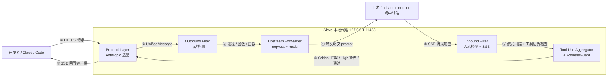

# Sieve 整体架构（Phase 1）

> **状态**：设计阶段 / 锁定执行
> **文档版本**：v1.0 / 2026-04-27
> **依据 PRD**：`[docs/prd/sieve-prd-v1.3.md](../prd/sieve-prd-v1.3.md)`
> **范围**：Phase 1（12 周 GA），仅适配 Claude Code + Anthropic Messages API

---

## 1. 架构总览

### 1.1 部署拓扑（直接对应 PRD §6.1）

```
┌────────────────────────────────────────────────────┐
│  Claude Code                                        │
│        ↓ ANTHROPIC_BASE_URL=http://127.0.0.1:11453 │
└────────────────────┬───────────────────────────────┘
                     ↓
┌────────────────────────────────────────────────────┐
│  Sieve 本地代理（Rust 单二进制）                    │
│                                                      │
│  ┌──────────────────────────────────────────────┐  │
│  │ Protocol Layer                                │  │
│  │  └ Anthropic Messages API + SSE              │  │
│  │  └ 内部表示：UnifiedMessage（预留三家扩展）  │  │
│  └──────────────────────────────────────────────┘  │
│                     ↓                                │
│  ┌──────────────────────────────────────────────┐  │
│  │ Outbound Filter Pipeline                      │  │
│  │  ├ vectorscan 多模式正则（SIMD）             │  │
│  │  ├ entropy / 校验位 / 上下文关键词           │  │
│  │  └ 占位符黑名单 + .sieveignore               │  │
│  └──────────────────────────────────────────────┘  │
│                     ↓                                │
│  ┌──────────────────────────────────────────────┐  │
│  │ Upstream Forwarder（reqwest + rustls）       │  │
│  │  → api.anthropic.com / 中转站                 │  │
│  └──────────────────────────────────────────────┘  │
│                     ⇅                                │
│  ┌──────────────────────────────────────────────┐  │
│  │ Inbound Filter Pipeline（SSE 流式）           │  │
│  │  ├ SSE Parser + partial-json-parser          │  │
│  │  ├ vectorscan stream mode                    │  │
│  │  ├ Tool Use Aggregator                       │  │
│  │  ├ AddressGuard                              │  │
│  │  └ Critical 拦截 / High 二次确认 / Medium 标记│  │
│  └──────────────────────────────────────────────┘  │
└────────────────────────────────────────────────────┘
```

### 1.2 数据流图（双向检测）




> 关键性质：**所有检测纯本地**，没有任何分支会把 prompt 发到 Anthropic 以外的 host（详见 [ADR-003](./ADR-003-local-only-no-cloud-verifier.md)）。

---

## 2. 模块职责矩阵


| 模块                           | 职责                                                                                                   | 输入                        | 输出                                              | 关键依赖                                                    |
| ---------------------------- | ---------------------------------------------------------------------------------------------------- | ------------------------- | ----------------------------------------------- | ------------------------------------------------------- |
| **Protocol Layer**           | 解析 Anthropic Messages API 请求/响应；将原始 JSON 映射到 `UnifiedMessage`；接口预留 OpenAI/OpenRouter（不实现）            | 原始 HTTP/JSON 字节流          | `UnifiedMessage` 结构                             | `hyper 1.x`、`tokio`、`sonic-rs`                          |
| **Outbound Filter Pipeline** | 对 outbound `UnifiedMessage` 执行 OUT-01~12 规则；产出 `Detection` 列表；按 §5.3 处置矩阵决定 Block/Redact/WarnConfirm | `UnifiedMessage`          | `(UnifiedMessage_可能脱敏, Vec<Detection>, Action)` | `vectorscan-rs`、`bip39`、`bs58`、`hex`、`sha2`、`crc32fast` |
| **Upstream Forwarder**       | 将（可能脱敏的）请求转发到上游；保持 SSE 长连接、TLS 终结、超时与重试                                                              | 已检测的 outbound 请求          | 上游 SSE 字节流                                      | `reqwest`、`rustls`、`tokio`                              |
| **SSE Parser**               | 流式切分 `event:` / `data:` 行；处理半行 chunk、跨 chunk 分隔、C0 控制字符、多 event 粘包、提前断流                              | 上游字节流                     | 完整 SSE event 序列                                 | 自研 + `bytes`                                            |
| **Tool Use Aggregator**      | 聚合 `tool_use` block 直到 JSON 完整（partial-json-parser）；在工具调用边界触发完整检查（5–15ms 预算）                         | SSE event 序列              | 完整 `tool_use` 对象                                | 自研 partial JSON parser                                  |
| **Inbound Filter Pipeline**  | 对 inbound 流执行 IN-CR-01~~05 + IN-GEN-01~~05；包含 vectorscan stream mode、AddressGuard、危险工具调用拦截           | SSE event + `tool_use` 对象 | 修改/拦截后的 SSE event 序列 + `Detection`              | `vectorscan-rs`（stream mode）、`AddressGuard`             |
| **AddressGuard**             | 维护本会话所有出现过的 `0x[a-fA-F0-9]{40}`；对模型新输出地址做：完全相同放行 / 前 N 后 M 匹配标红 / Levenshtein ≤ 4 标黄                 | 会话历史地址集合 + 新地址            | `Detection`（含相似度证据）                             | `strsim`（Levenshtein）、`hashbrown`                       |


> **共用依赖**：配置（`serde` + `toml`）、SQLite 审计日志（`rusqlite`）、license 验证（Ed25519 + JWT-like，详见 [data-model.md](./data-model.md) §8）。

---

## 3. 关键技术决策一览


| ID      | 决策                                        | 摘要                                                                                   | 链接                                                        |
| ------- | ----------------------------------------- | ------------------------------------------------------------------------------------ | --------------------------------------------------------- |
| ADR-001 | 选用 Rust 作为技术栈                             | hyper + tokio + rustls + vectorscan-rs + sonic-rs；Go regexp 慢 1000+ 倍，Python GIL 不可控 | [ADR-001](./ADR-001-rust-tech-stack.md)                   |
| ADR-002 | Phase 1 纯规则引擎，不引入本地 ML 模型                 | 三个独立论证：结构化优先 / 误报敏感 / 单人团队数据标注稀缺                                                     | [ADR-002](./ADR-002-rule-engine-only-phase1.md)           |
| ADR-003 | 完全本地运行，绝不联网 verifier                      | 不上传 prompt、不上传 fingerprint、不做云端 token 校验                                             | [ADR-003](./ADR-003-local-only-no-cloud-verifier.md)      |
| ADR-004 | Phase 1 只适配 Anthropic，UnifiedMessage 接口预留 | 公理 7：不为想象用户写代码；第二适配等真实付费用户主动提                                                        | [ADR-004](./ADR-004-anthropic-first-unified-interface.md) |
| ADR-005 | [redacted]作为收款与营销载体                           | 香港 → 新加坡 → [redacted]；[redacted]                                                      | [ADR-005](./ADR-005-overseas-legal-entity.md)             |
| ADR-006 | Sigstore 签名 + Reproducible Build + 透明日志   | 自证清白是产品定位（PRD §1.2 第 4 句），不只是工程实现                                                    | [ADR-006](./ADR-006-sigstore-reproducible-build.md)       |
| ADR-007 | Critical 等级 fail-closed，YOLO mode 不可关闭    | 签名工具调用 / rm -rf / curl|sh / eval(base64) 永远强制确认                                      | [ADR-007](./ADR-007-fail-closed-critical-actions.md)      |


---

## 4. 性能预算


| 操作                | 目标延迟        |
| ----------------- | ----------- |
| 普通 token 流式 chunk | +30–200 µs  |
| 工具调用边界完整检查        | +5–15 ms    |
| 整体 P99 添加延迟       | **< 20 ms** |
| 内存峰值              | < 100 MB    |
| 二进制大小             | < 20 MB 单文件 |
| 启动时间              | < 500 ms    |


**说明**：

- 普通 chunk（30–200 µs）走 vectorscan stream mode + 简单 entropy 计算，必须在用户感知阈值之下；
- 工具调用边界（5–15 ms）允许更重的检查（partial JSON 重组、AddressGuard 历史比对、多模式联合规则），因为这是不可逆动作前的最后一道闸；
- P99 < 20 ms 是面向 Claude Code 长会话的硬约束，超出意味着用户感知到"代理变慢了"，会触发卸载；
- 内存 100 MB 上限确保普通 dev 笔记本（16 GB RAM 是基线）在重度多窗口场景下 Sieve 不挤占其他进程；
- 二进制 < 20 MB + 启动 < 500 ms 是分发体验线，要确保 `brew install sieve` 后立即可用。

参考：[PRD §6.4](../prd/sieve-prd-v1.3.md)。

---

## 5. 误报率预算


| 检测类型     | Critical 拦截 FP 上限                  | High Warn FP 上限 |
| -------- | ---------------------------------- | --------------- |
| OUT-*    | < 0.5%（单条 Critical 各自上限见 PRD §5.1） | < 5%            |
| IN-CR-*  | < 0.5%                             | < 3%            |
| IN-GEN-* | N/A（全部 High 及以下）                   | < 10%           |


> **公理 12**：**Critical FP > 0.5% → 用户禁用产品**。这是硬约束，不是工程优化项。任何 Critical 规则在 dogfood / 闭测期间触发 FP 即被回滚或降级到 High。

参考：[PRD §6.5](../prd/sieve-prd-v1.3.md)。

---

## 6. 部署形态

Phase 1 部署形态收敛到 **CLI + 后台进程**，分发渠道与系统集成方式：


| 维度    | 选型                                                                                                          |
| ----- | ----------------------------------------------------------------------------------------------------------- |
| 分发    | `brew install sieve` / GitHub Releases 二进制下载（带 sigstore 签名）                                                 |
| 配置    | `~/.sieve/config.toml` + 环境变量覆盖                                                                             |
| 启动    | `sieve start` 前台 / `sieve daemon` 后台                                                                        |
| 守护    | macOS：`launchd`（user agent，非 system daemon）；Linux：`systemd --user`；Windows：服务（Phase 1 仅二进制可用，守护脚本 Week 6 给） |
| 客户端接入 | `export ANTHROPIC_BASE_URL=http://127.0.0.1:11453`                                                          |
| 可观测   | 本地 SQLite 审计日志（`~/.sieve/audit.db`，append-only），可选 stdout JSON log                                          |


**Phase 1 显式不做**：

- ❌ 桌面 GUI App（Electron / Tauri）
- ❌ VS Code 插件
- ❌ 浏览器扩展
- ❌ 系统级 mitm 代理（CA 证书安装）

理由：Phase 1 用户群（Claude Code crypto-native dev）已经习惯 CLI 配 env var，桌面 App 是 Phase 2 才考虑的扩客形态。

---

## 7. Phase 2 演进路径（触发条件，不是路线图）

下面四件事**只在条件触发时启动**，不进入 12 周里程碑：


| Phase 2 能力           | 触发条件                                                           |
| -------------------- | -------------------------------------------------------------- |
| 二阶段轻量 ML 分类器         | 用户实际 High FP 持续 4 周 > 5%，**且**至少 10 个真实付费用户主动反馈"误报太多"          |
| MCP 拦截（IN-MCP-01~03） | Week 16–20 启动；前提是 Phase 1 GA + 至少 1 个闭测用户在 dogfood 中触发过 MCP 调用 |
| 协议白名单 + Drainer 黑名单  | Phase 2 数据合作落地后（慢雾 misttrack-skills / ScamSniffer Pro 接通）      |
| OpenClaw / Hermes 适配 | **第二个真实付费用户**主动要求时（公理 7：不为想象用户写代码）                             |


> 这是"不做承诺，只做触发器"的原则——Phase 2 路线图的灵活性决定了[redacted]在 12 周后能否快速响应真实用户。

---

## 8. 不在 Phase 1 范围

为防范围蔓延，以下能力**显式标记为不在 Phase 1**：

- ❌ OpenAI / OpenRouter / Hermes / OpenClaw 协议适配（接口预留，不实现，见 [ADR-004](./ADR-004-anthropic-first-unified-interface.md)）
- ❌ 本地 ML 模型 / ONNX / 任何分类器（见 [ADR-002](./ADR-002-rule-engine-only-phase1.md)）
- ❌ 桌面 GUI / VS Code 插件 / 浏览器扩展
- ❌ 企业团队功能（多用户、SSO、审批工作流、SOC2）
- ❌ 云同步（配置 / 规则 / 审计日志全部本地，[ADR-003](./ADR-003-local-only-no-cloud-verifier.md)）
- ❌ 中文 PII / 内网域名 / 自定义规则 DSL（PRD §5.1 Phase 2）
- ❌ npm / pip typosquat、Markdown 链接钓鱼、Unicode 攻击、Calldata 解码、ERC20 危险 approve、Drainer 黑名单（PRD §5.2 Phase 2）
- ❌ [redacted] / [redacted] / [redacted]（PRD §7.3）

---

## 9. 相关文档

- [PRD-sieve v1.3](../prd/sieve-prd-v1.3.md)
- [data-model.md](./data-model.md) —— UnifiedMessage / Detection / 配置 / 审计日志 schema
- [ADR-001](./ADR-001-rust-tech-stack.md) —— Rust 技术栈
- [ADR-002](./ADR-002-rule-engine-only-phase1.md) —— Phase 1 纯规则引擎
- [ADR-003](./ADR-003-local-only-no-cloud-verifier.md) —— 完全本地，零云依赖
- [ADR-004](./ADR-004-anthropic-first-unified-interface.md) —— Anthropic-first，UnifiedMessage 接口预留
- [ADR-005](./ADR-005-overseas-legal-entity.md) —— [redacted]
- [ADR-006](./ADR-006-sigstore-reproducible-build.md) —— Sigstore + Reproducible Build
- [ADR-007](./ADR-007-fail-closed-critical-actions.md) —— Critical fail-closed
- `docs/api/api-reference.md` —— Anthropic Messages API 适配细节 + UnifiedMessage 字段 + 配置 schema

