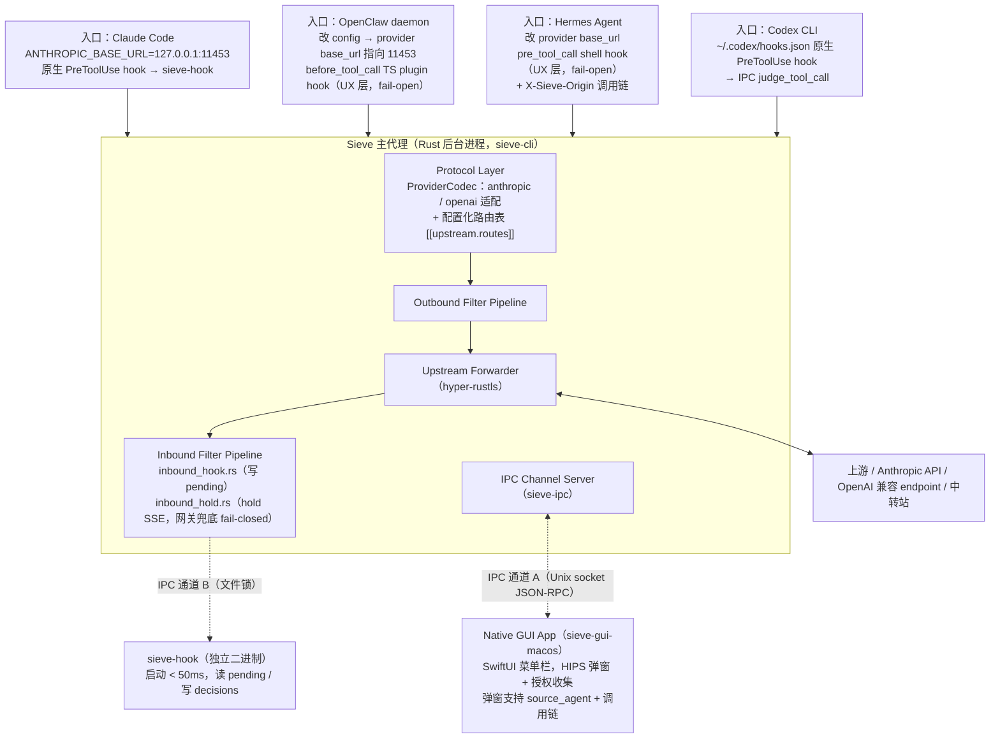
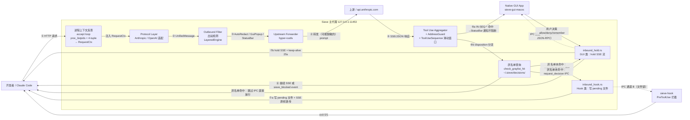

# Sieve 整体架构（Phase 1）

> Rendered: https://sieveai.dev/docs/threat-model.html

> **范围**：Phase 1，适配 Claude Code / OpenClaw / Hermes / Codex CLI 四家 AI agent；HIPS 改造（用户规则系统 + 三态决策 + 灰名单 + 进程上下文 + 行为序列窗口 + content-type 四路由对等 + 网关 ProviderCodec 分层 + 配置化路由表）

---

## 1. 架构总览

### 1.1 部署拓扑（三件套架构）

v1.4 引入三件套：Sieve 主代理（Rust 后台进程）、Native GUI App（独立仓库 `sieve-gui-macos`）、`sieve-hook`（独立 crate，Claude Code PreToolUse hook 入口）。

> **v2.x multi-listener 扩展**（2026-05-05）：Sieve 主代理升级为多 listener 架构，
> 同时绑定多个端口，每个 port 独立连接不同的真实上游 LLM endpoint。哑 client（Claude
> Code 等只认 single base_url 的 agent）通过指向不同 port 切换上游，无须注入路由 header。
> listener 显式声明协议（`anthropic` / `openai`），请求 path 错位时 daemon fail-closed
> 400 拒绝。
>
> 兼容性：v1.4 三件套架构不变；旧 sieve.toml（`upstream_url` + `port` 单字段）继续工作，
> 自动映射成单元素 listener。X-Sieve-Provider header routing（OpenClaw / Hermes）保留
> 兼容，与 port routing 并存。

> **multi-agent 扩展**：Sieve 主代理同时支持四家入口。v1.4 三件套架构不变，入口层扩展为：
> - **Claude Code**（ANTHROPIC_BASE_URL，原生 PreToolUse hook + 网关双层防御）
> - **OpenClaw**（多通道消息网关，改 daemon config 把所有 LLM provider base_url 指向 Sieve 11453 端口；具备 before_tool_call TS plugin hook 作 UX 层）
> - **Hermes Agent**（multi-provider 编排器，改每个 provider config 的 base_url；具备 pre_tool_call shell hook 作 UX 层；sub-agent 嵌套时主进程通过 `X-Sieve-Origin` header 传递调用链信息）
> - **Codex CLI**（OpenAI；原生 PreToolUse hook 注册在 `~/.codex/hooks.json`，经 IPC judge_tool_call 取裁决）
>
> 各入口共用同一个 Sieve 主代理实例，Protocol Layer 按请求路径分发（`/v1/messages` → Anthropic 适配；`/v1/chat/completions` → OpenAI 适配，详见 §10.2）。OpenClaw / Hermes 的 hook fail-open 不可配 fail-closed，故 hook 仅作 UX 层、安全不变量由网关 `inbound_hold` 兜底 fail-closed。

**入口拓扑图**：



> GUI App 代码在独立仓库 `sieve-gui-macos`。两仓库唯一硬约束是 IPC 协议版本号（`sieve-ipc` crate）。

### 1.2 数据流图（双向检测，含 IPC 分支）



> 关键性质：**所有检测纯本地**，没有任何分支会把 prompt 发到 Anthropic 以外的 host。Hook 类规则代理侧不修改 SSE 流；GUI 类规则 hold 流期间每 25 秒发送 SSE comment `: keep-alive\n\n` 防超时。**v2.0 新增**：灰名单命中时跳过 IPC 弹窗；accept loop 入口反查 caller PID + exe 注入所有 audit 写入；IN-SEQ-* 行为序列命中仅发 StatusBar 通知不阻断（feature `sequence_detection` 默认 off）。

---

## 2. 模块职责矩阵

### 2.1 本仓库 crate

| 模块（crate）                  | 职责                                                                                                   | 输入                        | 输出                                              | 关键依赖                                                    |
| ---------------------------- | ---------------------------------------------------------------------------------------------------- | ------------------------- | ----------------------------------------------- | ------------------------------------------------------- |
| **Protocol Layer**<br/>(`sieve-core`) | 解析 Anthropic Messages API 请求/响应；将原始 JSON 映射到 `UnifiedMessage`；接口预留 OpenAI/OpenRouter（不实现） | 原始 HTTP/JSON 字节流 | `UnifiedMessage` 结构 | `hyper 1.x`、`tokio`、`serde_json` |
| **Outbound Filter Pipeline**<br/>(`sieve-rules`) | 对 outbound `UnifiedMessage` 执行 OUT-01~12 规则；产出 `Detection` 列表；按处置矩阵路由到 AutoRedact / GuiPopup / StatusBar | `UnifiedMessage` | `(UnifiedMessage_可能脱敏, Vec<Detection>, Disposition)` | `vectorscan-rs`、`bip39`、`bs58`、`hex`、`sha2`、`crc32fast` |
| **Upstream Forwarder**<br/>(`sieve-core`) | 将（可能脱敏的）请求转发到上游；保持 SSE 长连接、TLS 终结、超时与重试 | 已检测的 outbound 请求 | 上游 SSE 字节流 | `hyper-rustls`、`tokio` |
| **SSE Parser**<br/>(`sieve-core`) | 流式切分 `event:` / `data:` 行；处理半行 chunk、跨 chunk 分隔、C0 控制字符、多 event 粘包、提前断流 | 上游字节流 | 完整 SSE event 序列 | 自研 + `bytes` |
| **Tool Use Aggregator**<br/>(`sieve-core`) | 聚合 `tool_use` block 直到 JSON 完整（partial-json-parser）；在工具调用边界触发 disposition 分流 | SSE event 序列 | 完整 `tool_use` 对象 + `Disposition` | 自研 partial JSON parser |
| **inbound_hook.rs**<br/>(`sieve-core`) | Hook 类规则命中后写 `~/.sieve/pending/<id>.json`；**不修改 SSE 流**，原样透传给 Claude Code | `tool_use` 对象 + `HookTerminal` disposition | pending 文件 + 透传 SSE | `sieve-ipc`（IPC 通道 B） |
| **inbound_hold.rs**<br/>(`sieve-core`) | GUI 类规则命中后 hold SSE 流；每 25s 发 keep-alive comment；经 IPC 通道 A 等待用户决策；用户拒绝时注入 `sieve_blocked` event | `tool_use` 对象 + `GuiPopup` disposition | hold 住的 SSE + keep-alive / sieve_blocked event | `sieve-ipc`（IPC 通道 A） |
| **AddressGuard**<br/>(`sieve-rules`) | 维护本会话所有出现过的 `0x[a-fA-F0-9]{40}`；对模型新输出地址做：完全相同放行 / 近似偏差标黄并触发 IN-CR-01 | 会话历史地址集合 + 新地址 | `Detection`（含相似度证据） | `strsim`、`hashbrown` |
| **sieve-ipc**<br/>（独立 crate） | IPC 协议库：Unix socket JSON-RPC server（通道 A）、pending/decisions 文件 IO（通道 B）、`~/.sieve/` 目录管理 | `DecisionRequest` / `DecisionResponse` | IPC 消息收发 + 文件读写 | `tokio`、`serde_json`、`fd-lock`、`uuid` |
| **sieve-hook**<br/>（独立 crate，独立二进制） | Claude Code PreToolUse hook 入口；启动 < 50ms；读 pending 文件；TTY y/n 倒计时；写 decisions 文件；exit 0/1 | `~/.sieve/pending/` 目录 | `~/.sieve/decisions/` 文件 + exit code | `serde_json`、`fd-lock`（最小依赖，禁止引入 vectorscan / rusqlite） |
| **sieve-cli**<br/>（入口 crate） | 入口 / 配置加载 / `sieve setup` / `sieve doctor` / `sieve uninstall`（macOS only）/ 审计日志（SQLite）/ launchd 守护 | CLI args + `config.toml` | 启动 daemon / 管理命令输出 | `anyhow`（仅此 crate 允许）、`rusqlite`、`clap` |
| **协议适配层 `protocol/openai.rs`**<br/>（`sieve-core`，**v1.5 新增**） | 解析 OpenAI Chat Completions API 请求/响应；将 delta / function_call / tool_calls 映射到 `UnifiedMessage`；处理 `data: [DONE]` 流结束标记 | 原始 HTTP/JSON 字节流（OpenAI 协议格式） | `UnifiedMessage`（与 anthropic.rs 输出一致，下游 Filter Pipeline 无感知） | `serde`、`serde_json`（与 anthropic.rs 共用） |
| **sieve-policy**<br/>（独立 crate，**v2.0 Phase A 新增**） | 用户规则系统：加载 `~/.sieve/rules/user.toml` + 11 类安全约束 lint + 与系统规则合并（`LayeredEngine`，`arc-swap` 热替换）+ 灰名单管理（`~/.sieve/decisions/`，含 Critical 锁三道防线）+ `sieve rules edit` $EDITOR pipeline；**禁做**：不直接做正则匹配（调 sieve-rules trait），不做网络 IO | `user.toml` + IPC reload 信号 | 用户规则 `MatchEngine` 实例（`Option<U>` 包装；加载失败时 None）+ 灰名单查询 API | `sieve-rules`（trait）、`sieve-ipc`、`fd-lock`、`tempfile`、`arc-swap` |
| **sieve-updater**<br/>（独立 crate，**更新通道客户端**） | manifest 协议客户端（`GET updates.sieveai.dev/v1/manifest`）+ install-id 生成与持久化（UUIDv4，`~/Library/Caches/sieve/install-id`）+ 6h 定时器（启动立即一次 + 周期触发）+ ed25519 + sha256 双重签名校验 + 三个 env var 解析（`SIEVE_NO_UPDATE` / `SIEVE_NO_TELEMETRY` / `SIEVE_UPDATE_URL`）+ 失败重试（指数退避 1s/4s/16s × 3）；**禁做**：不参与请求处理 / 不依赖 sieve-core 业务逻辑 / 不做规则文件原子替换 | `UpdaterConfig`（env + toml 解析）+ install-id 路径 | 规则包下载临时文件 + banner 打印 + tracing log | `tokio`（time/fs）、`reqwest`（rustls-tls）、`uuid`（v4）、`sha2`、`ed25519-dalek`、`thiserror` |

> updater task 在 `daemon::run` spawn 后台运行，**不在 hot path**，任何 updater 失败不影响 daemon 主流程。详见 [SPEC-006](../specs/SPEC-006-update-and-telemetry.md)。

> **关联说明**：协议适配层、用户规则系统、三态决策、规则引擎抽象（v2.0 Phase A）、行为序列窗口、进程上下文反查、content-type 路由矩阵（v2.1）的设计细节见本文相应章节；manifest 更新通道（sieve-updater）见 [SPEC-006](../specs/SPEC-006-update-and-telemetry.md)。

> **Native GUI App**（SwiftUI，常驻菜单栏、HIPS 弹窗、Preset 设置面板）在独立仓库 **`sieve-gui-macos`**，不在本 workspace。两仓库的协调契约是 `sieve-ipc` crate 中 IPC 协议版本（`v1` 起）。

> **共用依赖**：配置（`serde` + `toml`）、SQLite 审计日志（`rusqlite`，仅 `sieve-cli`）、license 验证（Ed25519 + JWT-like，详见 [data-model.md](./data-model.md) §8）。

---

## 3. 关键技术决策一览


| 决策                                        | 摘要                                                                                   |
| ----------------------------------------- | ------------------------------------------------------------------------------------ |
| 选用 Rust 作为技术栈                             | hyper + tokio + rustls + vectorscan-rs + serde_json；Go regexp 慢 1000+ 倍，Python GIL 不可控 |
| Phase 1 纯规则引擎，不引入本地 ML 模型                 | 三个独立论证：结构化优先 / 误报敏感 / 单人团队数据标注稀缺                                                     |
| 完全本地运行，绝不联网 verifier                      | 不上传 prompt、不上传 fingerprint、不做云端 token 校验                                             |
| Phase 1 只适配 Anthropic，UnifiedMessage 接口预留 | 不为想象用户写代码；第二适配等真实用户主动提                                                        |
| Sigstore 签名 + Reproducible Build + 透明日志   | 可独立验证是产品定位，不只是工程实现                                                    |
| Critical 等级 fail-closed，YOLO mode 不可关闭    | 签名工具调用 / rm -rf / curl|sh / eval(base64) 永远强制确认                                      |


---

## 4. 性能预算


| 操作                | 目标延迟        | v2.0 实测       |
| ----------------- | ----------- | -------------- |
| 普通 token 流式 chunk | +30–200 µs  | —              |
| 工具调用边界完整检查        | +5–15 ms    | ~327 µs（P99）  |
| 整体 P99 添加延迟       | **< 20 ms** | < 1 ms（实测）    |
| LayeredEngine 额外开销 | < 20%       | **-3%**（early return 净提速） |
| 内存峰值              | < 100 MB    | —              |
| 二进制大小             | < 20 MB 单文件 | —              |
| 启动时间              | < 500 ms    | —              |


**说明**：

- 普通 chunk（30–200 µs）走 vectorscan stream mode + 简单 entropy 计算，必须在用户感知阈值之下；
- 工具调用边界（5–15 ms）允许更重的检查（partial JSON 重组、AddressGuard 历史比对、多模式联合规则），因为这是不可逆动作前的最后一道闸；
- P99 < 20 ms 是面向 Claude Code 长会话的硬约束，超出意味着用户感知到"代理变慢了"，会触发卸载；
- **LayeredEngine**（v2.0）：系统规则 + 用户规则两层，因用户规则 early return 机制实测较基准反而减少约 3% 开销；
- 内存 100 MB 上限确保普通 dev 笔记本（16 GB RAM 是基线）在重度多窗口场景下 Sieve 不挤占其他进程；
- 二进制 < 20 MB + 启动 < 500 ms 是分发体验线，要确保 `.dmg` 安装后立即可用；
- IPC 往返（主代理 → GUI → 主代理，不含用户决策时间）：< 50 ms；
- `sieve-hook` 启动时延（fork → TTY 出现）：< 50 ms（依赖最小化，实测 4–5 ms）；
- GUI 类规则 hold 流期间 keep-alive comment 间隔：**25 s**；
- IN-CR-05（签名工具）最长 hold 时长：**120 s**（超时 fail-closed）。

---

## 5. 误报率预算


| 检测类型     | Critical 拦截 FP 上限                  | High Warn FP 上限 |
| -------- | ---------------------------------- | --------------- |
| OUT-*    | < 0.5%（单条 Critical 各有独立上限） | < 5%            |
| IN-CR-*  | < 0.5%                             | < 3%            |
| IN-GEN-* | N/A（全部 High 及以下）                   | < 10%           |


> **核心约束**：**Critical FP 超过 0.5% → 用户禁用产品**。这是硬约束，不是工程优化项。任何 Critical 规则一旦触发误报即被回滚或降级到 High。

### 5.1 回归基线

> 误报率与召回率由回归数据集持续守护，能力阈值为 Critical FP < 0.5%、攻击召回 > 95%。SSE 流与非流式 `application/json` 两条响应路径对所有入站类别完全对等（历史说明见 [SECURITY.md](../../SECURITY.md)）。

回归数据集由合成攻击、benign 会话回放、公开攻击复现三层构成，跑 `cargo test -p sieve-rules --release --test dataset_fp_rate -- --ignored --nocapture` 校验落在能力阈值内。

数据集三层结构：
1. **合成攻击**：按"看起来像攻击但合法"（benign-near/near-{规则ID}/）+ "用户最怕的五件事"（attacks-by-fear/{signing,transfer,env-leak,private-key,shell-rce}/）双向对称分桶
2. **公开攻击复现**（attacks-public-replay/）：6 个子目录覆盖 rugpull-ai / injection-pocs / ctf-replays / owasp-llm-top10 / real-events / mcp-supply-chain

### 5.2 规则引擎 stopwords 全文搜索机制（v1.5.1 新增）

> **v2.0 升级**：MatchEngine trait `scan(&[u8])` 接口将在 v2.0 Phase A 升级为 `scan(ScanRequest) -> ScanReport`，带上下文（direction / protocol / content_kind / tool_name / source_agent / caller_exe），让规则知道自己在哪条路径生效。LayeredEngine 包装系统规则 + 用户规则两层引擎，合并顺序保证用户规则不能 suppress 系统 Critical。


`is_excluded(matched_text, full_context, rule)` 在 `allowlist_stopwords` 命中时，**在完整上下文中搜索停用词**而非仅在 7-20 字节的命中片段。这让短命中（`eval $`、`rm -rf /`、`systemctl enable`）能识别教学/合法场景：

- **教学短语**：`the difference between` / `DO NOT RUN` / `compare to a suspicious case` / `IN-CR-* 自说明`
- **合法 shell 初始化**：`ssh-agent -s` / `direnv hook` / `starship init` / `pyenv init` / `brew shellenv` / `mise activate`
- **Dockerfile 安全前缀**：`/var/lib/apt/lists/` / `/var/cache/` / `/tmp/` / `node_modules`
- **官方 registry 域名**：`registry.npmjs.org` / `pypi.org` / `npm.pkg.github.com`

调用点：`sieve-cli/engine_adapter.rs`（生产路径）+ `sieve-rules/tests/{inbound_rules,dataset_fp_rate}.rs`（测试）。

---

## 6. 部署形态（v1.4 三件套）

Phase 1 部署形态为 **macOS .dmg 安装包**，包含三件套：Native GUI App + Rust 后台代理 + `sieve-hook` 命令行。分发渠道与系统集成方式：

| 维度 | 选型 |
|------|------|
| 分发 | macOS `.dmg` 安装包（含 GUI App + 后台代理 + `sieve-hook`，带 sigstore 签名 + Notarization） |
| 配置 | `~/.sieve/config.toml` + 环境变量覆盖 |
| 安装引导 | `.dmg` 安装后运行 `sieve setup`：自动写入 Claude Code `settings.json` hook 注册项（`onError: block`）、配置 `ANTHROPIC_BASE_URL`、生成 launchd plist |
| 守护 | macOS：`launchd` user agent（`~/Library/LaunchAgents/com.sieve.daemon.plist`）；`sieve setup` 自动注册开机自启 |
| 客户端接入 | `ANTHROPIC_BASE_URL=http://127.0.0.1:11453`（`sieve setup` 自动配置，详见 [SPEC-003](../specs/SPEC-003-sieve-setup-tool.md)） |
| PreToolUse hook | `sieve-hook check`（`sieve setup` 写入 Claude Code hook 注册，`onError: block` 保证 fail-closed） |
| IPC | 通道 A：`~/.sieve/ipc.sock`（Unix socket JSON-RPC，代理 ↔ GUI）；通道 B：`~/.sieve/pending/` + `~/.sieve/decisions/`（文件锁 JSON，代理 ↔ sieve-hook） |
| 可观测 | 本地 SQLite 审计日志（`~/.sieve/audit.db`，append-only）+ `sieve doctor` 全链路自检 |

**v1.4 显式不做**：

- ✅ macOS SwiftUI 独立进程（`sieve-gui-macos` 仓库）—— **已撤销**原 v1.3 中"❌ 桌面 GUI App（Electron / Tauri）"的否决；该否决只针对 webview 方案，不适用 native SwiftUI
- ❌ 操作系统级 Network Extension / 本地 CA 注入 / MITM（推 Phase 3）
- ❌ Linux / Windows 平台支持（推 Phase 2）
- ❌ VS Code 插件 / 浏览器扩展
- ❌ 修改 `~/.zshrc` / `~/.bashrc`（PATH 由 .dmg 安装包的 post-install script 处理，`sieve setup` 不写 shell rc）

**v1.5 新增（multi-agent setup）**：

- ✅ multi-agent 配置注入（v1.5 起）：`sieve setup --agent claude|openclaw|hermes`，支持多 `--agent` 参数同时配置，以及 `sieve setup --all-detected`（自动检测系统已装的 agent，逐个 dry-run + 确认）。详见 [SPEC-004](../specs/SPEC-004-multi-agent-setup.md)。
- 三家 agent 各自配置注入路径：

| Agent | 配置目标 | 注入字段 |
|-------|---------|---------|
| Claude Code | `~/.claude/settings.json` | `env.ANTHROPIC_BASE_URL` + `hooks.PreToolUse` |
| OpenClaw | `~/.openclaw/config.toml` | provider router 表里所有 `base_url` |
| Hermes | `~/.hermes/config.toml` 或 `.env` | 每个 provider 的 `base_url` |

---

## 7. Phase 2 演进路径（触发条件，不是路线图）

下面几件事**只在条件触发时启动**，不进入当前里程碑：


| Phase 2 能力           | 触发条件                                                           |
| -------------------- | -------------------------------------------------------------- |
| 二阶段轻量 ML 分类器         | 用户实际 High FP 持续偏高，**且**足够多真实用户反馈"误报太多"          |
| MCP 拦截（IN-MCP-01~03） | 前提是 Phase 1 GA + 至少 1 个用户在 dogfood 中触发过 MCP 调用 |
| 协议白名单 + Drainer 黑名单  | Phase 2 外部威胁情报数据合作落地后      |
| 更多协议适配 | **真实用户主动要求时**（不为想象用户写代码）                             |


> 这是"不做承诺，只做触发器"的原则——触发器机制保证按真实需求演进，不预先承诺路线图。

---

## 7.5 历史架构限制（v1.5.x 入站检测仅覆盖流式 SSE，**v2.1 已闭合**）

### 入站检测曾仅覆盖流式 SSE 响应

> **状态**：v2.1 通过 content-type 路由矩阵闭合 **tool_use 类**（见 §12）；**响应文本类（IN-CR-01 地址替换 / IN-GEN-* 文本规则，`observe_event` 类）于 2026-06-20 通过 `InboundFilter::scan_assistant_text` 四路由共享核心补全**（见下「修复方案」步骤 6）。至此 SSE + JSON 双路径对所有入站类别完全对等。本节保留作历史说明。

**历史现状**：早期 `Inbound Filter Pipeline` 的 `forward_with_inbound_inspection` 假定 upstream
response body 是 `text/event-stream` 字节流，喂给 `SseParser` + `Aggregator` 才能解析
出 tool_use。对 `application/json` 单体响应（Anthropic Messages API 不传 `stream:true`
时的默认格式）整个 body 原样透传，存在入站检测缺口——IN-CR-02 / IN-CR-03 /
IN-CR-04 / IN-CR-05 / IN-GEN-* 在非流式路径上未生效。

**风险性质**：入站检测是 Sieve 的核心能力，非流式路径的入站检测缺口
属严重产品级缺陷，对应 Critical 漏报率不可控。

**修复方案**（v2.1 已落地）：
1. `daemon::proxy_inner` 在 forward 完上游后，按 `response.headers["content-type"]`
   分流：`text/event-stream` → 现有 SSE 路径；`application/json` → JSON 路径
2. JSON 路径 collect 完整 body，反序列化为 `AnthropicResponse`，遍历 `content[]`
   提取 `tool_use` 块，手工构造 `CompletedToolCall` 喂 `InboundFilter::on_tool_use_complete`
3. 命中 fail-closed Critical 时把 body 替换为 `sieve_blocked` 等价 JSON 错误结构
   （HTTP 200 + `{"type":"error",...,"sieve_blocked":...}`），同时更新 content-length
4. 容量上限参考既有 SSE channel cap，单 message body 上限 ~8MB
5. 集成测试 `inbound_block.rs` 加 mock 非流式 upstream case 强制覆盖
6. **（2026-06-20 补全 `observe_event` 类）** 上述步骤 2 的 v2.1 修复只覆盖了 `content[]`
   的 **tool_use** 类（`on_tool_use_complete`）；响应**文本**类（`observe_event` /
   `scan_text`：IN-CR-01 地址替换、IN-GEN-* 文本规则）当时**仍只挂 SSE**，两条 JSON
   路径 by-construction 不扫 assistant 文本——与 v1.5.4 同型的残留 P0。已抽出
   `InboundFilter::scan_assistant_text` 作为 SSE `observe_event` 与两条 JSON handler
   （`handle_anthropic_json_inbound` / `handle_openai_json_inbound`）的**共享文本检测核心**，
   两条 JSON 路径分别用 `anthropic_completion_text` / `openai_completion_text` 提取
   assistant 文本喂入；并补四路由 TEXT-trigger 集成测试（`content_type_matrix.rs::
   *_json_in_cr01_text_substitution`，接线前 RED、接线后 GREEN）。至此 IN-CR-01 在四条
   content-type 路由真正对等。

**v1.4 双层防御下的分层影响**：

- **Hook 类（IN-CR-02~04、IN-GEN-01~03）**：这些规则由 `sieve-hook` 在 Claude Code PreToolUse 阶段拦截，不依赖 SSE 流处理路径。非流式 JSON 路径对 Hook 类规则**不构成缺口**——即使代理层看不到非流式 body，只要 Claude Code 发起 PreToolUse，sieve-hook 仍会读 pending 文件并拦截。上述修复主要针对 pending 文件写入仍依赖代理检测的场景。
- **GUI 类（IN-CR-01/05、IN-GEN-04）**：这些规则依赖代理的 SSE 流处理（hold 流 + IPC 通知 GUI）；非流式 JSON 路径的缺口对 GUI 类适用。**IN-CR-05**（tool_use 类）由 v2.1 修复方案步骤 1-5 闭合；**IN-CR-01**（响应文本地址替换，`observe_event` 类）此前未被步骤 1-5 覆盖，已于 **2026-06-20 通过 `scan_assistant_text` 共享文本核心补全**（步骤 6）。非流式 JSON 无 keep-alive hold，GUI 类 `HoldForDecision` 在 JSON 路径降级为 fail-closed `Block`。

**关联**：content-type 路由矩阵（见 §12）；经验教训——入站检测必须 SSE + JSON 四路由对等，不能只覆盖流式 SSE。

---

## 8. 不在 Phase 1 范围

为防范围蔓延，以下能力**显式标记为不在 Phase 1**：

- ✅ ~~OpenAI / OpenRouter / Hermes / OpenClaw 协议适配（接口预留，不实现）~~（**v1.5 撤销此限制**：OpenAI 协议 + OpenClaw / Hermes 适配已纳入 Phase 1，Week 6-7 实现，见 §10.2）
- ❌ 本地 ML 模型 / ONNX / 任何分类器（推 Phase 2）
- ❌ VS Code 插件 / 浏览器扩展（推 Phase 2）
- ❌ 操作系统级 Network Extension / 本地 CA 注入 / MITM（推 Phase 3）
- ❌ Linux / Windows 平台支持（推 Phase 2）
- ❌ Gemini / Mistral / Cohere / Ollama 等其他 LLM 协议（推 Phase 2；Phase 1 仅实现 Anthropic + OpenAI 两种上游协议）
- ❌ 修改 `~/.zshrc` / `~/.bashrc`（PATH 由 .dmg 安装包处理）
- ❌ 企业团队功能（多用户、SSO、审批工作流、SOC2）
- ❌ 云同步（配置 / 规则 / 审计日志全部本地）
- ❌ 中文 PII / 内网域名 / 自定义规则 DSL（Phase 2）
- ❌ npm / pip typosquat、Markdown 链接钓鱼、Unicode 攻击、Calldata 解码、ERC20 危险 approve、Drainer 黑名单（Phase 2）
- ❌ 给 OpenClaw / Hermes 提 PR 实现 hook 等价物（Phase 1 后期目标，不阻塞 GA；网关 inbound_hold 已兜底 100% fail-closed）

---

## 10. Multi-Agent 扩展架构（v1.5 新增）

> 本章描述多家 AI agent 适配的工程架构细节。v1.4 章节（§1~§9）保持不变，本章独立增补。

### 10.1 四家 agent 的拓扑差异

| 维度 | Claude Code | OpenClaw | Hermes Agent | Codex CLI |
|------|-------------|----------|--------------|-----------|
| 上游 LLM 协议 | Anthropic Messages API | OpenAI Chat Completions（多 provider） | OpenAI Chat Completions（多 provider） | OpenAI |
| Sieve 接入方式 | `ANTHROPIC_BASE_URL` env var | daemon config `base_url` 字段 | provider config `base_url` 字段 | `base_url` + `~/.codex/hooks.json` |
| Hook 机制 | ✅ 原生 PreToolUse hook → `sieve-hook` | ✅ before_tool_call TS plugin hook（fail-open） | ✅ pre_tool_call shell hook（fail-open） | ✅ 原生 PreToolUse hook → IPC judge_tool_call |
| Hook 角色 | UX 层（终端 y/N） | UX 层；安全由网关兜底 | UX 层；安全由网关兜底 | UX 层（仅交互式 codex） |
| 安全不变量 | 网关 inbound_hold fail-closed | 网关 inbound_hold fail-closed | 网关 inbound_hold fail-closed | 网关 inbound_hold fail-closed |
| Critical 规则处置 | fail-closed（不可关闭） | fail-closed（不可关闭） | fail-closed（不可关闭） | fail-closed（不可关闭） |
| X-Sieve-Origin 注入方 | `sieve setup` 写 Claude Code settings | 用户手动 or `sieve setup --agent openclaw` | Hermes 自身通过 `ANTHROPIC_DEFAULT_HEADERS` 注入子进程 | 不适用 |
| sub-agent 嵌套 | 不适用（叶节点） | 不适用 | ✅ Hermes delegate 给 Claude Code / Codex，chain_depth ≥ 1 | 不适用 |

> 关键约束：**Critical 规则在所有 agent 上都不可关闭**。各 agent 的 hook 只承担 UX 层（让用户就近确认）；OpenClaw / Hermes 的 hook fail-open 不可配 fail-closed，安全不变量统一由网关 `inbound_hold` 兜底 fail-closed，不依赖 agent 侧 hook。

### 10.2 协议适配层

v1.5 Protocol Layer 新增 `openai.rs`，与 `anthropic.rs` 并列：

```
crates/sieve-core/src/protocol/
├── mod.rs          # 按请求路径分发（/v1/messages → anthropic, /v1/chat/completions → openai）
├── anthropic.rs    # v1.4 已实现
└── openai.rs       # v1.5 新增
```

**路径分发规则**：

| 请求路径 | 协议适配器 | 适用 agent |
|---------|-----------|-----------|
| `POST /v1/messages` | `anthropic.rs` | Claude Code |
| `POST /v1/messages/count_tokens` | `anthropic.rs` | Claude Code |
| `POST /v1/chat/completions` | `openai.rs` | OpenClaw / Hermes / Codex CLI |
| 其他 `/v1/...` | 501 Not Implemented | — |

> 协议兼容但路径非标准的中转站可经配置化路由表 `[[upstream.routes]]`（`{ path, provider }`）一行映射到对应 provider，无须改代码；解析优先级 = 标准路径硬保证 → 用户路由表 → listener 协议兜底。

**UnifiedMessage 中间表示**：两个协议适配器输出相同的 `UnifiedMessage` schema，下游 Filter Pipeline 无感知。SSE 格式差异由适配器内部消化：
- Anthropic：`event: content_block_delta` + `data: {...}` 结构
- OpenAI：`data: {"choices":[{"delta":{...}}]}` + `data: [DONE]` 结束标记

OpenAI 协议适配的 UnifiedMessage 映射细节见上述 §10.1~10.2。

### 10.3 X-Sieve-Origin header 协议

用于解决 Hermes sub-agent 嵌套调用时的双重弹窗问题。

**header 格式**：`X-Sieve-Origin: <source_agent>:<request_id>:<chain_depth>`

**示例**：
- `X-Sieve-Origin: claude:abc-123:0`（用户直接调 Claude Code）
- `X-Sieve-Origin: hermes:def-456:0`（用户直接调 Hermes）
- `X-Sieve-Origin: hermes-delegate-claude:def-456:1`（Hermes 转给 Claude Code，chain_depth=1）

**关键语义**：
- `chain_depth ≥ 2`：强制 GUI hold，嵌套深度过大的调用属于可疑行为
- `chain_depth ≥ 5`：直接返回 426（调用链过深，拒绝处理）
- 已有父层 allow 记录（同 `request_id`）且 `chain_depth > 0`：子层弹窗去重，不再重复询问用户

**注入机制**：Hermes 启动 Claude Code 子进程时，通过 `ANTHROPIC_DEFAULT_HEADERS` 环境变量自动注入，用户无需手动配置。

**防伪造**：header 携带 Ed25519 签名（公钥由 `sieve setup` 预置，私钥由 Sieve 主代理持有）；伪造或无效签名的 header 视同无 header 处理（chain_depth=0，不降级）。

X-Sieve-Origin header 协议的完整规格见 [api-reference.md §7](../api/api-reference.md)。

### 10.4 hook 作 UX 层 + 网关兜底

各 agent 的 pre-tool hook 都作为 UX 层（让用户就近确认工具调用）。Claude Code 与 Codex CLI 走原生 PreToolUse hook；OpenClaw（before_tool_call TS plugin）与 Hermes（pre_tool_call shell hook）的 hook fail-open 不可配 fail-closed，因此安全不变量不依赖 hook——网关层的 `inbound_hold` 始终兜底 fail-closed：

| 规则类型 | hook 命中时（UX 层） | 安全兜底（网关层，恒生效） |
|---------|---------------------|--------------------------|
| Hook 类 Critical | 就近确认（终端 y/N 或 agent hook） | 网关 inbound_hold fail-closed，超时拒绝 |
| Hook 类 High | 就近确认 | 网关层按处置矩阵 hold / warn |
| GUI 类 Critical | GUI hold | 网关 inbound_hold fail-closed |

**说明**：
- 安全性统一：Critical 始终 fail-closed，无论 agent hook 是否生效；hook fail-open 不影响安全不变量。
- UX 差异：原生 hook 的 agent 可在终端就近确认；其余经 GUI hold 确认。
- 缓解措施：用户可在 GUI Preset 面板调整非 Critical 类规则的 UX 路径，但 **Critical 类规则始终强制 fail-closed**（不可放宽）。

### 10.5 Multi-Agent 配置注入

`sieve setup --agent` 参数新增三家 agent 的配置注入能力，详细规格见 [SPEC-004](../specs/SPEC-004-multi-agent-setup.md)。

**关键行为约束**：
- 与 v1.4 `sieve setup`（无 `--agent` 参数，默认配置 Claude Code）向后兼容
- 每次配置修改前打印 diff + 要求 `y` 确认；原始文件备份到 `~/.sieve/backups/`
- `sieve setup --all-detected` 自动检测系统已安装的 agent（扫描 `~/.openclaw/`、`~/.hermes/` 等路径），逐个 dry-run 展示将要修改的字段
- `sieve doctor --agent openclaw` 支持单独诊断某家 agent 的接入状态
- 退出码：`0` 全部成功 / `1` 至少一个 agent 配置失败但已回滚 / `2` 部分失败且回滚也失败（紧急状态，stderr 输出需要手动清理的步骤）

---

## 11. 相关文档

- [data-model.md](./data-model.md) —— UnifiedMessage / Detection / 配置 / 审计日志 schema（v2.0：灰名单 schema、user.toml schema、HoldOutcome 枚举）
- [SPEC-001](../specs/SPEC-001-sieve-hook-protocol.md) —— sieve-hook 文件 IPC 协议
- [SPEC-002](../specs/SPEC-002-hips-popup-behavior.md) —— HIPS 弹窗行为规范
- [SPEC-003](../specs/SPEC-003-sieve-setup-tool.md) —— sieve setup 详细规格
- [SPEC-004](../specs/SPEC-004-multi-agent-setup.md) —— multi-agent 配置注入规格（v1.5 新增）
- `docs/api/api-reference.md` —— 反向代理 API 适配细节 + 环境变量 + 配置 schema（含 v1.5 X-Sieve-Origin §7）

---

## 12. HIPS 改造（v2.0/v2.1）

> Sieve 从"基础 LLM 代理防护"升级为完整 HIPS（Host-based Intrusion Prevention System）。

v2.0/v2.1 在 v1.5 双层防御基础上新增以下能力，合计覆盖 HIPS 14 项标准：

| HIPS 能力项 | 落地版本 | 实现说明 |
|------------|---------|---------|
| 用户自定义规则 | v2.0 Phase A | `sieve-policy` crate + `user.toml`；`direction` 字段按出/入站分流到两侧 `LayeredEngine` |
| 三态决策（allow / deny / remember） | v2.0 Phase A | `HoldOutcome` 枚举扩展；灰名单 `decisions/<digest>.json` 持久化 |
| 规则引擎抽象 LayeredEngine | v2.0 Phase A | `MatchEngine` trait + `ScanRequest`/`ScanReport` 带上下文；系统规则 + 用户规则两层，Critical 不可被用户规则 suppress |
| 热加载用户规则 | v2.0 Phase A | `arc-swap` 原子替换 `LayeredEngine.user`；IPC `ReloadUserRules` 信号触发 zero-downtime swap |
| IPC 扩展（单向通知 + 多 GUI broadcast） | v2.0 Phase A | `StatusBarNotify`（SequenceHit / OutboundRedacted / UserRulesLoadFailed / UserRulesReloaded / Generic）；`gui_writers: Vec<Sender>` |
| 进程上下文反查 | v2.0 Phase B | accept loop 通过 macOS `proc_listpids` + `proc_pidfdinfo` 4-tuple 反查 caller PID/exe，注入 `RequestCtx` |
| 行为序列窗口 IN-SEQ-* | v2.0 Phase B（beta）| `ToolUseSequence` 滑动窗口（窗口大小与过期时长可配置）；仅 StatusBar 通知不阻断（feature `sequence_detection` 默认 off） |
| content-type 路由矩阵（JSON 非流式路径，tool_use 类） | v2.1 | 修复非流式 `application/json` 入站检测盲区（tool_use 类）；SSE + JSON 双路径对 tool_use 对等 |
| JSON 路径文本扫描补全（IN-CR-01 地址替换 / IN-GEN-* 文本规则，`observe_event` 类） | 2026-06-20 | `InboundFilter::scan_assistant_text` 四路由共享核心：补全 v2.1 仅覆盖 tool_use 留下的 JSON 文本类缺口（v1.5.4 同型 P0），四路由真正对等 |

Critical 永不可关、完全本地、不联网 verifier 等核心硬约束在 v2.0 改造中**全部保持**。

---

## 13. 行为序列窗口（v2.0 Phase B beta）

> feature flag `sequence_detection`，**默认 off**；v2.0 Phase B 实验性功能，v3.0 正式启用。

### 13.1 设计原理

单次工具调用的静态规则（IN-CR-* / IN-GEN-*）无法检测跨工具调用的复合攻击序列。行为序列窗口在 `InboundFilter::SessionState` 内维护 `ToolUseSequence` 滑动窗口，观察最近若干次工具调用的时序组合。

### 13.2 窗口参数

| 参数 | 值 |
|------|-----|
| 窗口大小 | 可配置（最近若干次工具调用） |
| 过期时长 | 可配置（超时丢弃） |
| 检测项 | IN-SEQ-* 家族（启发式） |
| 处置 | **仅 StatusBar 通知，不阻断** |

### 13.3 双路径不变量

SSE 流式路径与 JSON 非流式路径都接入 `record_into_sequence_and_detect` helper，保证序列记录无论上游返回哪种格式都不遗漏。

### 13.4 约束

- feature off 时序列记录代码不执行（zero overhead）；
- IN-SEQ-* 不属于 Critical，**永不阻断工作流**；
- 窗口内容纯内存，不写 audit.db，不跨进程持久化。

