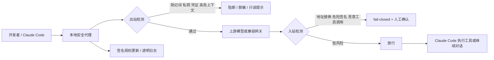

# Sieve 方向再评估报告（基于 v1.2 → v1.3 转折点）

> **版本说明**：本报告原始撰写时基于 PRD v1.2，但其结论（海外注册、合规边界、自证清白叙事、单代理收敛）已被 [PRD v1.3](../prd/sieve-prd-v1.3.md) §0 明确采纳为 8 条 GPT-5.5 review 改动的来源。
>
> 后续阅读视角：把本文当成"v1.3 设计评审存档"，而非"待解决的 review 列表"。

## 执行摘要

基于你上传的两版 PRD，我将“这个方向”理解为：一个**以本地代理为核心、先服务 Claude Code 等 AI 编程代理、以 crypto 高危场景为楔子、由单人团队启动的安全产品/研究方向**。从判断结果看，这个方向**值得做，但必须继续收缩边界**：它更像一个“高严重度事件防护工具”而不是一个“泛 AI 安全平台”。研究上，这一方向已经被近期论文直接验证为真实且被低估的攻击面；产品上，本地代理与规则引擎路线在 6–12 个月内可由小团队落地；商业上，最佳切口不是泛开发者，也不是中国内地 crypto 客户，而是**海外 crypto-native、重度使用 AI 编码代理的小团队与个人开发者**。你最新版本从多代理/多层收费收敛到单代理、单价格、12 周 GA，这个收敛是正确的，但还应再砍掉“大而全”的 ambitions。fileciteturn0file0 fileciteturn0file1 citeturn25view0turn28view4turn31view5

我给出的核心结论有三条。第一，**最强的技术与商业组合点**不是“检测所有 prompt injection”，而是“阻断少量但极昂贵的失误”：助记词/私钥泄露、恶意地址替换、危险签名与 calldata、恶意工具调用。第二，**首发产品形态应当是本地、可解释、fail-closed、低延迟**，优先依赖确定性规则、协议解析和签名化规则更新，而不是一开始就依赖本地小模型分类器。第三，**中国大陆视角下**，如果它只是开发者侧安全工具、并不向境内公众提供生成式 AI 服务，生成式 AI 备案压力比面向公众的 AI 应用小；但 2026 年 2 月的官方通知继续对虚拟货币相关业务、信息服务和导流维持高压监管，因此“大陆首发 + crypto 营销”并不是理想路线。更合理的做法是：把中国视为**研发与合规约束**，把首发收入市场放在境外。citeturn32view0turn32view2turn32view1turn35view0turn21search0turn26view6turn6search4

## 评估对象与假设

本报告采用的关键假设如下：你要评估的对象是 Sieve，而不是一个完全抽象的“AI 安全”概念；已上传 PRD 中明确了几个硬约束——**单人起步、先兼容 Claude Code、先做本地代理、先聚焦 crypto 开发者、短期不做重销售组织、目标 12 周达到可收费 GA**。未明确之处，我按“最保守、最容易验证”的方式处理：真实种子用户数、实际误报率、安装转化率、支持平台优先级、是否开源核心引擎、以及规则更新机制目前都属于 unspecified。fileciteturn0file0 fileciteturn0file1

从两版 PRD 的演进来看，方向已经发生了明显收敛：从更宽的“多代理/多层套餐/平台化叙事”，收缩为更窄的“Claude Code + 本地代理 + 单一价格 + 先防高损失事件”。这说明你已经在往正确方向走，因为这个赛道最大的失败模式通常不是“做不出来”，而是**在没有数据与分发能力时过早平台化**。我因此把“再次评估”的重点放在：这个方向**究竟该被理解成研究题目、产品想法、技术路线，还是市场切口**；以及不同理解下的优先级是否一致。fileciteturn0file0 fileciteturn0file1

在中国大陆维度，需要单独说明两点。其一，《生成式人工智能服务管理暂行办法》明确，**未向境内公众提供生成式 AI 服务的研发与应用**不在其直接适用范围内；但面向公众的应用、包括通过 API 调用模型能力的应用，仍可能涉及备案或登记。其二，截至 2025 年底，官方披露累计已有 **748 款生成式 AI 服务完成备案、435 款应用或功能完成登记**，说明面向公众的 AI 产品在内地已经进入“可做，但必须合规流程化”的阶段。citeturn21search0turn26view6

## 多重解读与横向比较

下表把“这个方向”拆成四种最 plausible 的解释。这个表不是四个互斥项目，而是同一方向的四种看法；优先级代表我对你当前阶段的建议排序。综合依据来自已上传 PRD、近期代理安全研究、现有市场格局与中国大陆监管边界。fileciteturn0file0 fileciteturn0file1 citeturn25view0turn29view0turn35view0turn26view6

| 解读方式 | 范围定义 | 主要用户 / 受益者 | 核心成功指标 | 技术难度 | 时间线 | 当前优先级 |
|---|---|---|---|---|---|---|
| 研究课题 | 研究 AI 编码代理在客户端—路由器—模型—工具链中的中间人攻击与可部署防御 | AI 安全研究者、代理框架维护者、模型厂商 | 攻击成功率下降、secure task completion、误报率、增加延迟 | 中高 | 12–36 个月 | 高 |
| 产品方向 | 做一个面向 Claude Code 的本地 LLM 流量防火墙 / 安全代理 | 重度 AI 编码开发者、小团队、独立黑客 | 严重告警误报率、保护事件数、日活安装、付费留存 | 中 | 6–12 个月 | 最高 |
| 市场切口 | 以 crypto-native AI 开发者为高痛点垂直市场 | 智能合约开发者、审计团队、协议工程师 | 每千会话拦截高危事件、WTP、口碑传播、设计伙伴转付费 | 中 | 6–12 个月 | 高 |
| 平台 / 商业模式 | 开源核心 + 签名规则源 + 透明更新日志 + 可选威胁情报订阅 | 开源社区、平台厂商、进阶安全团队 | 活跃安装、规则更新采用率、付费 feed 转化、社区贡献 | 中高 | 12–36 个月 | 中 |

## 各解释的深入评估

**作为研究课题，它是成立且有新意的。** 最新论文《Your Agent Is Mine》直接把“第三方 API router/代理层可见明文 JSON、但缺乏端到端完整性保证”定义为独立攻击面，并在付费与免费 router 上观察到恶意注入、条件投递、密钥触碰甚至资产损失。与此同时，entity["organization","OWASP","appsec nonprofit"]、entity["organization","NIST","us standards body"] 以及中国的entity["organization","中国信息通信研究院","beijing china"]都已经把 agentic AI 的运行时安全、治理与主动防御纳入正式框架。代表性近五年参考可优先盯这五组：**Your Agent Is Mine**（2026）、**AgentDojo**（2024）、**Defeating Prompt Injections by Design**（2025）、**Simple Prompt Injection Attacks Can Leak Personal Data…**（2025）、以及 NIST 的 **AI RMF Generative AI Profile**（2024）；中文语境下，可补充中国信通院关于生成式 AI 安全挑战与主动防御的研究。citeturn25view0turn11search7turn25view1turn26view0turn31view6turn7search0turn7search2

**这个研究解读下的 state of the art 已经很清楚，但空白也很清楚。** 现有前沿方法主要分成四类：一类是 benchmark/attack 环境，如 AgentDojo；一类是**把控制流与数据流分离**的架构型防御，如 CaMeL；一类是运行时 policy gate / anomaly screening / transparency logging；还有一类是围绕 MCP、第三方工具和 agent 生命周期做治理的工程型指南。优势是学术新、社会相关性强、也能反哺产品可信度；短板是**真实世界数据难拿、实验可重复性差、落地系统常常牺牲可用性**。最大的研究空白不是“prompt injection 是否存在”，而是：**编码代理场景下的中间人攻击如何被低误报地实时阻断；透明日志如何在不暴露隐私的前提下证明没有被代理篡改；以及端到端可验证性如何覆盖工具调用与模型响应链条**。citeturn25view1turn29view0turn30view6turn30view7

**作为产品方向，它短期最可行。** 你不需要训练基础模型，也不需要托管推理；依赖的是本地代理、协议适配、规则引擎、加密签名、少量可解释的解析器。entity["company","Anthropic","ai company"] 的 Messages API 本身就是 stateless 的，而且支持 Zero Data Retention 安排；其文档也表明 Claude Code 能通过 MCP 接入大量外部工具和数据源，且官方明确警告第三方 MCP 服务器存在 prompt injection 风险。换言之，**产品存在真实、不断扩大的拦截面**。代表性近五年资料建议用这几组：Anthropic Messages API / Claude Code MCP 文档、entity["company","GitHub","developer platform"] secret scanning 文档、entity["company","GitGuardian","secrets security"] 的 secrets sprawl 报告、以及 entity["company","BerriAI","litellm vendor"] 维护的 LiteLLM 在 2026 年暴露出的供应链与代理安全问题。citeturn33view0turn33view1turn31view3turn31view4turn31view2turn31view1turn29view3turn28view5turn31view7turn2search2

**这一产品解读下，最佳方法不是“先上模型”，而是“先上规则和语义解析”。** 原因有三个。第一，编码代理中的高风险事件往往是**结构化**的：私钥形态、BIP39 助记词、地址、EIP-712、函数 selector、危险 shell/tool 调用，都比泛文本更适合可解释规则。第二，开发者对误报极其敏感，官方 secret scanning 的演进也说明：生产可用的检测通常依赖模式、validity checks、定制规则与逐步扩展，而不是全部押在分类器上。第三，单人团队最稀缺的是“持续标注高质量 benign/malicious 会话”的能力，而不是算力。产品短板也很明显：代理层接入容易被上游协议变化打断，用户天然不喜欢“中间层”，同时会质疑“为什么不直接信任模型厂商或现有 secret scanning 工具”。所以这条路的关键不是功能多，而是**极少数高严重度规则、极低噪声、极强可解释性**。citeturn31view2turn31view1turn10search0

**作为市场切口，crypto-native AI 开发者是正确但狭窄的 wedge。** 这个切口成立，不是因为它用户多，而是因为它**单次事故损失极高、支付意愿更集中、且现有防护多停留在“用户签名前一跳”**。entity["company","Blockaid","web3 security"] 和 entity["company","GoPlus Security","web3 security"] 的公开材料已经表明，当前成熟方案核心在于交易仿真、恶意地址、合约交互与 on-chain 安全 API；它们很强，但重点更多在**钱包与交易生命周期**，而不是 AI 编码代理在“生成代码、替换地址、拼装 calldata、触发工具调用”这一更前置的链路。与此同时，entity["company","Electric Capital","crypto venture firm"] 的公开开发者数据说明 crypto 开发者生态仍然足够大且全球化，而 Anthropic 的经济研究说明“coding 仍是最常见 AI 使用场景之一”，且 Claude Code 的早期采用更偏 startup。也就是说，**“AI coding 高渗透 + crypto 高损失”**确实形成了可收费交叉点。citeturn32view3turn32view4turn27view4turn27view5turn8search1turn31view5

**这个市场解读下的最佳产品目标不是“保护所有 Web3 用户”，而是“保护少量高价值开发行为”。** 你应该优先防四类对象：BIP39 助记词与私钥外泄、地址替换与地址投毒、EIP-712/ABI/selector 异常、以及让代理执行危险工具调用。因为这些对象都有确定性规范：BIP39 有 checksum 和固定词表；EIP-712 有标准化 typed structured data；4byte.directory 可把 selector 与人类可读函数签名对应起来。技术上，这意味着**极强的语义可解释性**；商业上，这意味着你可以把“被救回一次就回本”当成最直接的 ROI 叙事。这个切口的短板则是明显的：TAM 不会太大，攻击样本更新快，而且在中国大陆，2026 年 2 月上海市转载的八部门通知继续明确虚拟货币相关业务、信息中介、定价、导流与互联网展示受到严格禁止，因此大陆面向 crypto 的公开商业化空间很差。citeturn32view0turn32view2turn32view1turn35view0

**作为平台 / 商业模式方向，最值得保留的是“开源可信 + 签名规则源”，而不是立即做企业平台。** 代理安全领域一个很现实的问题是：用户不仅要信任你“能挡住风险”，还要信任你“不会自己成为风险”。这意味着你的护城河不应只来自检测能力，还应来自**可验证的供应链与规则更新机制**。这里最有价值的代表性资料是：OWASP 的 agentic AI solutions landscape 与 secure MCP guides，外加 entity["organization","Sigstore","software signing project"] 和 entity["organization","Reproducible Builds","software supply chain project"] 所代表的软件签名、透明日志、可复现构建实践。对于一个安全产品，特别是本地代理，这种“自证清白”的能力几乎和检测本身一样重要。citeturn29view0turn30view6turn30view7turn20search0turn27view3

**但平台化不能提前。** 现有企业 AI 安全市场已经出现了像 entity["company","Lakera","ai security"] 这类覆盖运行时防护、red teaming、治理与合规的玩家，而且 OWASP 的 2026 landscape 已经把 agentic AI 生命周期中的商业与开源方案映射得相当完整。这意味着，如果你现在把自己定义成“通用 AI agent security platform”，那你会立即进入一个**需要 enterprise sales、治理能力、跨团队集成与大量客户成功**的赛道，这和单人项目、12 周 GA 目标正面冲突。更稳妥的做法是：**开源核心、签名规则、透明更新**作为信任基础；收费部分放在更窄的“高质量规则包、团队策略、威胁情报 feed、以及更深的协议解析”上。citeturn30view3turn29view0

## 可行性与实施路径

从工程实现看，这个方向的**总体难度是中到中高，不是高到不可做**。困难主要不在算力，而在**误报控制、协议兼容与持续规则维护**。短期 MVP 完全可以不依赖 GPU：只做本地代理、协议解析器、规则匹配、简单状态机、签名化规则更新和可选的本地日志。中期如果要覆盖更复杂的 prompt attack、MCP 工具上下文或多代理系统，再考虑把轻量分类器放进第二道检测链，而不是第一道。这个判断与近期研究和官方文档是一致的：真实运行时风险来自 router、MCP、tool-calling 与 secrets sprawl，而这些风险首先是**结构问题、权限问题、供应链问题**，其次才是模型问题。citeturn25view0turn31view3turn30view6turn31view2turn29view3

如果按照单人起步来估算，我建议把资源拆成三层。**短期 6–12 个月**：1 名全栈安全工程负责人即可，重点是 macOS/桌面集成、本地代理、规则引擎、日志/UI、协议解析；外加少量设计伙伴，不追求大规模数据。**中期 12–36 个月**：增加 1 名规则/后端工程师和 1 名安全研究或样本运营角色；这时才适合做团队策略、签名规则 feed、更多上游兼容。**长期 36+ 个月**：如果产品证明有效，再决定是否往平台、SDK 或企业治理走。就资金而言，它是**可 bootstrap 的**：若不计创始人工资，云与签名设施成本不高；若进入 2–3 人全职阶段，才会明显上升。这里真正昂贵的不是基础设施，而是**分发与验证**。 

| 阶段 | 建议做什么 | 人员 / 数据 / 计算 | 主要风险 |
|---|---|---|---|
| 6–12 个月 | Claude Code 本地代理；秘密 / 助记词 / 地址 / EIP-712 / 危险工具四类高危防护；签名规则更新；10 个左右设计伙伴 | 1 人即可；公开规则与协议数据为主；几乎不需要 GPU | 误报、接入脆弱、价值证明不足 |
| 12–36 个月 | MCP / 更多代理兼容；团队策略；透明日志；威胁情报对接；更细语义解析 | 2–3 人；需要更多真实 benign/恶意 session；轻量模型可选 | 维护面扩大、单 vendor 依赖、支持成本上升 |
| 36+ 个月 | SDK / 平台化 / 企业版 / 非 crypto 行业扩展 | 组织化团队；持续样本与合规能力 | 销售周期长、与大厂/成熟厂商正面竞争 |

主要风险与对应缓解手段也比较明确。**误报风险**用 severity 分级、默认只拦高危、其余只提醒来控制；**单厂商依赖**通过 adapter abstraction 与 OpenAI-compatible 接口兼容来缓冲；**信任问题**通过开源核心、Sigstore 签名、透明日志与可复现构建来解决；**分发风险**通过设计伙伴与真实 saved incidents 案例驱动；**中国大陆合规风险**通过本地处理、最小日志、避免面向境内 crypto 业务营销来规避。对于 AI 产品本身，还需要遵守个人信息最小必要原则；而如果未来要面向中国境内公众做 AI 能力包装，则还要考虑备案/登记与模型信息公示。citeturn20search0turn27view3turn6search4turn21search0turn26view6turn35view0

## 优先方向与下一步

**第一优先方向，是把它做成一个“高严重度事件本地保护器”。** 我建议只做四类阻断：助记词/私钥/高价值凭证外发，地址替换，危险签名/typed data，危险工具调用。不要试图在第一版里解决“所有 prompt injection”。接下来 4–6 周的实验应该是：搭建 200–500 条合成攻击样本和 50–100 条真实 benign 会话回放；定义严重告警误报率目标；要求 p95 额外延迟足够低；并用 canary secrets、假地址、恶意 selector 做封闭测试。成功标准不是召回率论文数字，而是**严重拦截的低噪声可解释性**。citeturn32view0turn32view2turn32view1turn31view2

**第二优先方向，是把 crypto 语义解析做深，而不是把通用覆盖做宽。** 你真正的差异化，不在“能看 prompt”，而在“能理解 Web3 风险对象”。建议优先实现：BIP39 验证、EIP-712 结构解析、常见 ABI/selector 解码、地址信誉查询接口、以及对代码 diff 中 hardcoded address 的变更监控。下一步 pilot 最适合找 5–10 个海外 crypto dev 团队、审计研究员或高频 hackathon builder，而不是找传统大企业。合作上，最有价值的不是云模型厂商，而是能提供**恶意地址 / 合约风险 / selector 语料**的数据侧伙伴。citeturn32view3turn32view4turn27view4turn27view5

**第三优先方向，是尽快把“我自己不是风险”做成产品特征。** 这意味着：规则包签名、更新日志可核验、开源核心或至少开源规则 DSL、最小化默认遥测、用户可导出本地审计日志。对安全产品来说，这比多一个模型、多个 dashboard 更重要。下一步工程动作应该是把规则更新和发布链路接入 Sigstore／透明日志，并把“为什么拦、拦了什么、如何复现”做成用户界面的一部分。citeturn20search0turn27view3

**第四优先方向，才是 MCP 与多代理扩展。** 这是中期增量，不是首发前提。官方文档与 OWASP 指南都说明 MCP 会显著扩大外部工具访问、OAuth scope 与 prompt injection 面，但这也意味着接入面、权限模型、兼容维护会陡增。正确顺序不是“先支持所有 MCP”，而是“先把本地代理核心打磨到可收费，再挑 2–3 个最常见 MCP 场景做 allowlist + scope-aware policy”。citeturn31view3turn31view4turn30view6turn30view7

**不建议当前阶段优先做的方向**也很明确：不建议先做 enterprise sales；不建议先做“通用 AI 安全平台”；不建议先压注本地小模型分类器；不建议把中国大陆作为 crypto 付费用户首发市场。前两者会让组织成本暴涨，第三者会让误报与数据问题先爆雷，第四者则会直接撞上大陆对虚拟货币相关业务和互联网展示、导流的监管高墙。citeturn35view0

## 持续调研线索

建议后续继续使用这些检索式。围绕研究：`"malicious intermediary attacks llm supply chain"`, `"AgentDojo prompt injection tool-calling"`, `"Defeating Prompt Injections by Design CaMeL"`。围绕产品：`"Claude Code MCP security"`, `"local llm proxy secrets scanning"`, `"LiteLLM proxy security advisory"`。围绕 crypto 语义：`"BIP39 checksum validator false positives"`, `"EIP-712 typed data risk detection"`, `"4byte selector risk decoding"`。围绕中国大陆：`"生成式人工智能 API 调用 备案 登记"`, `"个人信息保护法 本地日志 最小必要"`, `"虚拟货币 信息技术服务 合规 上海 2026"`。citeturn25view0turn33view0turn31view2turn35view0

建议持续跟踪的源包括：arXiv、entity["organization","OWASP","appsec nonprofit"] GenAI Security Project、entity["company","Anthropic","ai company"] 官方文档、entity["organization","NIST","us standards body"]、entity["company","GitHub","developer platform"] 安全文档、entity["company","Electric Capital","crypto venture firm"] 开发者报告、entity["organization","国家互联网信息办公室","cyberspace admin china"] 与中国政府公开法规、entity["city","上海","Shanghai, China"] 市政府公开公文库、EIPs、bitcoin/bips、4byte.directory，以及 entity["company","Blockaid","web3 security"]、entity["company","GoPlus Security","web3 security"]、entity["company","Lakera","ai security"] 等公开产品资料。citeturn29view0turn33view0turn31view6turn27view5turn26view6turn35view0turn32view2turn32view0turn32view1turn32view3turn32view4turn30view3

## 开放问题与局限

这份评估最大的局限，是**你上传 PRD 的完整正文在当前上下文中不可全文检索，只能基于已暴露的摘要信息做判断**；因此，关于你真实的用户访谈、试用样本、安装转化、目标操作系统优先级、以及是否已经有种子设计伙伴，这些都仍是 unspecified。其次，关于中国大陆是否把这类本地安全代理认定为安全产品、开发者工具、还是间接 AI 应用，实际落地还会受到具体部署形态影响。最后，如果未来你希望扩大到公开面向中国用户的 AI 应用层，而非单纯开发者本地工具，那么备案、登记、日志、内容治理和个人信息处理义务都会显著上升。citeturn21search0turn26view6turn6search4turn35view0